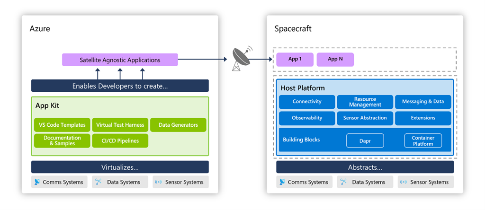

# Azure Orbital Space SDK
The Azure Orbital Space SDK is a solution designed to lower the barriers for developing applications intended to run on spacecraft. The solution was created to be able to run on any spacecraft, providing a secure hosting platform and application kit to create, deploy, and operate applications on-orbit.
As a space partner, you can leverage the Space SDK to offer edge processing on your satellite and provide your customers with the power, approachability, and security of the Microsoft development tools and the Azure ecosystem.

## Getting Started

First time working with the Azure Orbital Space SDK? Check out our [Getting Started Guide](./docs/getting_started.md).

## Overview

Want to learn more about what the Azure Orbital Space SDK is and how it works? Start with these resources:

- [About the Azure Orbital Space SDK](./overview/about-space-sdk.md)
- [Detailed Architecture Documentation](./architecture/README.md)
- [System Requirements](./overview/requirements.md)

## Quick-Starts, Samples, and Tutorials

Ready to become a space software developer? Get started with our starter projects and guides:

- [Tutorials and Quick Starts](tutorials/README.md)
- [Sample ONNX Application](../samples/payloadapps/python/shipdetector-onnx/placeholder)
- [Sample Tensorflow Application](../samples/payloadapps/python/shipdetector-tf/placeholder)
- [Starter .NET Application](../samples/payloadapps/dotnet/starter-app/placeholder)
- [Starter Python Application](../samples/payloadapps/python/starter-app/placeholder)

## Contributing

Find something you'd like to improve? See how on our [Contributing Guide](./CONTRIBUTING.md).

## Legal

Looking for our software license and other legal information? View our [Legal Guide](./LEGAL.md).

## Additional Resources

Searching for something else? Find it quickly in our [Table of Contents](./docs/table_of_contents.md).
