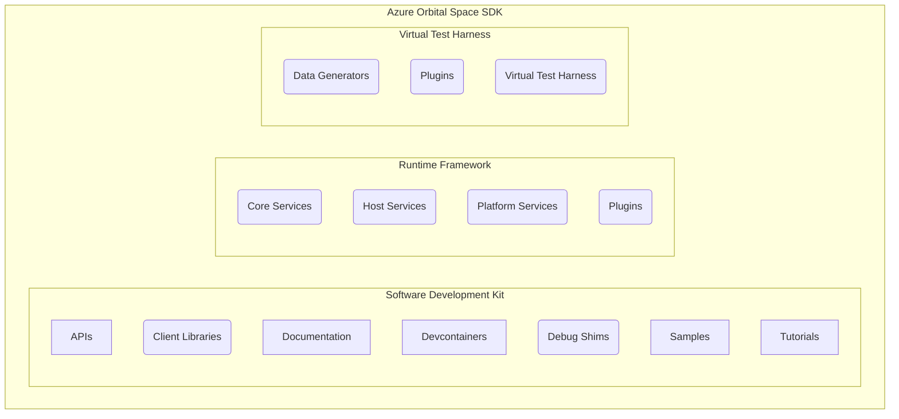

# Azure Orbital Space SDK

The Azure Orbital Space SDK is a software development kit, runtime framework, and virtualization platform that makes it easy to develop and deploy applications to space.

As an application developer, the Azure Orbital Space SDK abstracts complex satellite systems and operations into simple components with clear, standardized actions and interfaces. This allows you to focus on what matters - developing the applications you need on orbit.

As a satellite service provider, the Azure Orbital Space SDK provides a lightweight, secure runtime framework that allows your satellites to be treated as a generic compute platform. Through interface standardization satellites become reusable assets that can be modified on orbit to execute different missions through payload applications. Payload applications can be deployed to any of your satellites with zero downtime and no code modifications required.

## Getting Started

First time working with the Azure Orbital Space SDK? Check out our [Getting Started Guide](./docs/getting-started.md).

## Overview

Want to learn more about what the Azure Orbital Space SDK is and how it works? Start with these resources:

- [About the Azure Orbital Space SDK](./docs/overview/about-space-sdk.md)
- [Detailed Architecture Documentation](./docs/architecture/architecture.md)
- [System Requirements](./docs/overview/requirements.md)

## Quick Starts and Tutorials

Ready to become a space software developer? Get started with our starter projects and guides:

- [Quick Starts and Tutorials](./docs/quick-starts/README.md)

## Sample Applications

- [Sample ONNX Application](./samples/payloadapps/python/shipdetector-onnx/placeholder)
- [Sample Tensorflow Application](./samples/payloadapps/python/shipdetector-tf/placeholder)
- [Starter .NET Application](./samples/payloadapps/dotnet/starter-app/placeholder)
- [Starter Python Application](./samples/payloadapps/python/starter-app/placeholder)

## Contributing

Find something you'd like to improve? See how on our [Contributing Guide](./CONTRIBUTING.md).

## Legal

Looking for our software license and other legal information? View our [Legal Guide](./LEGAL.md).

## Additional Resources

Searching for something else? Find it quickly in our [Table of Contents](./docs/table-of-contents.md).
