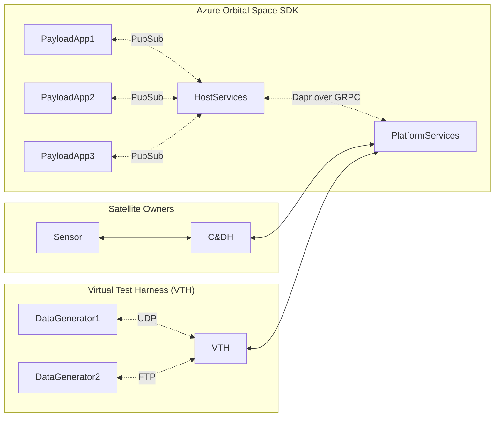

# Azure Orbital Space SDK

The Azure Orbital Space SDK is a microservices platform that abstracts spacecraft telemetry and sensor data to provide a common interface for satellite operators and payload application developers to use data collected in-orbit.

An application could conceivably be written once to the Azure Orbital Space SDK APIs and run on any spacecraft that has the Azure Orbital Space SDK installed, allowing for reuse of the application across many flavors and families of satellite hardware and telemetry and sensor data sources.

## Architecture Diagram

In the diagram below, you'll see three components that illustrate the utility of the Azure Orbital Space SDK.

1. **The Azure Orbital Space SDK**

    From the developer's perspective, you develop strongly-typed applications using the Client Libraries interact with spacecraft data on-orbit in a generic way using the Host Services.

    Visit the **[Client Libraries](./components/client-libraries.md)** documentation for more information on what packages are available to payload application developers.

    Visit the **[Host Services](./components/host-services.md/)** documentation for more information on what data and capabilities are available to payload application developers.

1. **The spacecraft and its sensors**

    From the spacecraft's perspective, you schedule and execute payload applications and translate spacecraft telemetry and sensor data to a common format via Platform Services.

    Visit the **[Platform Services](./components/platform-services.md)** documentation for more information on what capabilities are available to Satellite Owner Operators.

1. **The Virtual Test Harness (VTH)**

    For development and test, you use the Virtual Test Harness (VTH) as a ground-based instantiation of both the Azure Orbital Space SDK and the spacecraft to develop and test your applications just as you would in-orbit.

    Visit the **[Virtual Test Harness](./components/virtual-test-harness.md)** documentation for more information on wiring up **[Data Generators](./components/virtual-test-harness.md#data-generators)** to feed your applications simulated or recorded data from storage or other sources like web services.

## Plugins

Extensibility, customization, and interoperability with a variety of spacecraft and sensors of the Azure Orbital Space SDK is achieved through the use of plugins.

Visit the **[Plugins](./components/plugins.md)** documentation for more information on what plugins are and how to author them.

## Developer Tools

See **[Developer Tools](./developer-tools)** documentation for more information on what is used to develop, and develop solutions on top of, the Azure Orbital Space SDK.

## Kubernetes Configuration

See **[Kubernetes](./kubernetes.md)** documentation for more information on how Kubernetes is configured
