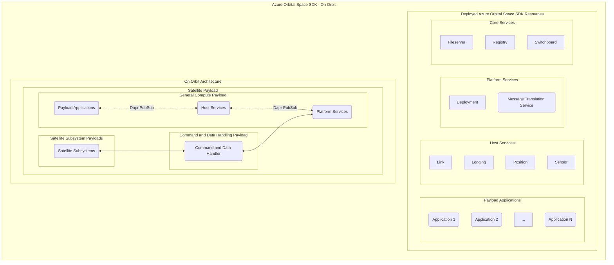

# Azure Orbital Space SDK Architecture Overview

The Azure Orbital Space SDK consists of a runtime framework, software development kit, and virtual test harness. Payload application developers use the software development kit to create applications that can interact with the runtime framework. The runtime framework provides a set of microservices that abstract the complexities of satellite systems, allowing developers to focus on creating applications that fulfill their specific needs.

The Azure Orbital Space SDK is designed to be flexible and extensible. It provides a standardized interface for interacting with satellite systems, but also allows for customization through the use of plugins. This means that satellite system providers can extend the functionality of the SDK to meet their specific requirements.

The SDK is built on a microservices architecture, which provides a number of benefits. It allows for independent development and deployment of services, which can improve development speed and reduce the impact of failures. It also allows for scalability, as services can be scaled independently based on demand.

The Azure Orbital Space SDK also includes a Virtual Test Harness (VTH), which provides a means of replicating environments seen on orbit. This allows developers to test their applications in a realistic environment before deployment.

In the following sections, we will delve deeper into the components of the Azure Orbital Space SDK, including the runtime framework, the software development kit, and the virtual test harness.

## Runtime Framework

The Azure Orbital Space SDK Runtime Framework is a collection of microservices built on a common architecture. We provide client libraries for application developers to interface with spacecraft in a standardized and predictable way. Host services abstract interactive logical components of a satellite to these developers, which satellite system providers can extend through the use of plugins.

The runtime framework is designed to be robust and reliable, capable of operating in the challenging environment of space. It is built on a microservices architecture, which allows for independent development and deployment of services.

The runtime framework includes core services, host services, and platform services. Core services provide fundamental functionality such as secure file access, docker image registry management, and switchboard services. Host services provide logical abstractions of a satellite's interactive components and operations. Platform services provide functionality such as application deployment and lifecycle management and interface to a satellite's hardware and subsystems.

The runtime framework is designed to be extensible. Satellite system providers can extend the functionality of the SDK through the use of plugins to customize these services to meet their specific requirements.

### Components

#### Core Services

Core services provide the fundamental functionality required for the operation of the runtime framework. These services include:

- [Core Service](./runtime-framework/core-services/core.md)
- [Fileserver](./runtime-framework/core-services/fileserver.md)
- [Registry](./runtime-framework/core-services/registry.md)
- [Switchboard](./runtime-framework/core-services/switchboard.md)

#### Host Services

Host services provide logical abstractions of a satellite's interactive components and operations. These services include:

- [Link](./runtime-framework/host-services/link.md)
- [Logging](./runtime-framework/host-services/logging.md)
- [Position](./runtime-framework/host-services/position.md)
- [Sensor](./runtime-framework/host-services/sensor.md)

#### Platform Services

Platform services provide functionality such as application deployment and lifecycle management and interface to a satellite's hardware and subsystems. These services include:

- [Deployment](./runtime-framework/platform-services/deployment.md)
- [Message Translation Service (MTS)](./runtime-framework/platform-services/message-translation-service.md)

#### Supporting Technologies

The runtime framework leverages several open source supporting technologies. These include:

- [Dapr](https://dapr.io/)
- [Kubernetes (k3s)](https://k3s-io.github.io/)
- [Samba](https://www.samba.org)

To learn more about the Azure Orbital Space SDK Runtime Framework, please refer to our detailed [Azure Orbital Space SDK Runtime Framework](./runtime-framework/runtime-framework.md) documentation.

## Software Development Kit

The Azure Orbital Space SDK Software Development Kit is a comprehensive collection of tools, libraries, code samples, and other resources designed to facilitate development on the Azure Orbital Space SDK runtime framework. The SDK is designed to support developers at every stage of the development process, making it easier to create and deploy space-based applications.

The SDK includes client libraries for .NET and Python, providing a standardized interface for interacting with the runtime framework. These libraries abstract the complexities of the underlying system, allowing developers to focus on creating applications that fulfill their specific needs.

The SDK also includes development tools such as Devcontainers and Debug Shims. Devcontainers provide a consistent development environment, reducing the potential for discrepancies between different developers' setups. Debug Shims allow developers to test their applications by deploying them into the runtime framework with an active debugger.

In addition to these resources, the SDK provides a variety of code samples, tutorials, and quick-starts. These resources are designed to help developers get started with the SDK and learn how to use its various features. The code samples provide practical examples of how to use the SDK, while the tutorials and quick-starts guide developers through the process of creating their first applications.

### Components

- Application Programming Interfaces (APIs)
- Azure Orbital Space SDK Documentation
- Client Libraries for .NET and Python
- Development Tools such as Devcontainers and Debug Shims
- Samples, Tutorials, and Quick-Starts

To learn more about the Azure Orbital Space SDK Software Development Kit, please refer to our detailed [Azure Orbital Space SDK Software Development Kit](./software-development-kit/software-development-kit.md) documentation.

## Virtual Test Harness (VTH)

The Azure Orbital Space SDK Virtual Test Harness (VTH) provides a means of virtually replicating environments seen on orbit. The VTH is designed to simulate the challenging conditions of space, allowing developers to test their applications under realistic conditions before deployment.

The VTH is logically separated from the Azure Orbital Space SDK runtime. This separation ensures that payload applications and service plugins run the exact same way in a test environment as they would on orbit. This feature is crucial for ensuring the reliability and robustness of applications before they go to orbit.

The VTH is composed of a virtual test harness service, plugins, and one or more data generators. Data generators provide the environmental data that simulates what an application might encounter on orbit. The Azure Orbital Space SDK provides several out-of-the-box data generators you can use to get started building your applications, or you can create your own. Plugins extend and modify the functionality of the VTH, giving developers the customization and flexibility they need to control their virtual environments.

The VTH can also be used to integrate hardware components into the runtime environment. This feature allows developers to test their applications against the actual hardware components that will be available on their spacecraft.

The VTH is designed to be flexible and customizable. Developers can choose the fidelity and functionality needed in their virtualization environment, allowing them to tailor the test environment to their specific requirements. This flexibility makes the VTH a powerful tool for developing and testing space based applications.

### Components

- [Data Generators](./virtual-test-harness/data-generators/data-generators.md)
- [Virtual Test Harness (VTH)](./virtual-test-harness/virtual-test-harness.md)

To learn more about the Azure Orbital Space SDK Virtual Test Harness, please refer to our detailed [Azure Orbital Space SDK Virtual Test Harness (VTH)](./virtual-test-harness/virtual-test-harness.md) documentation.
