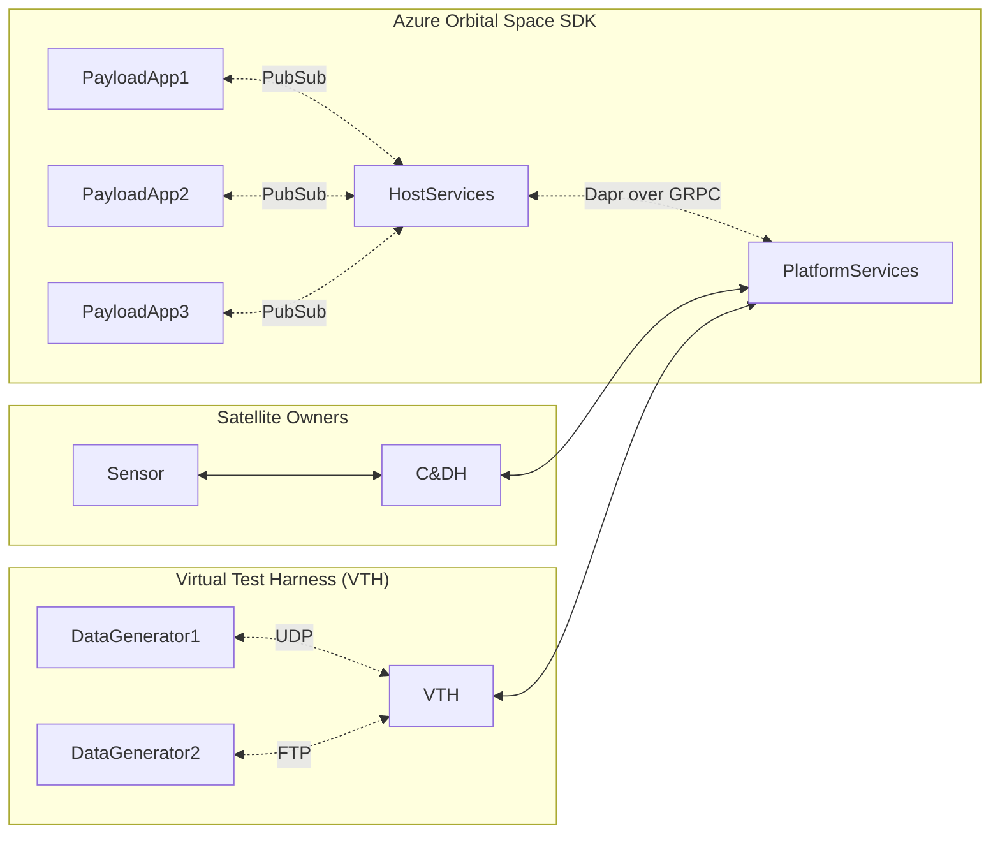
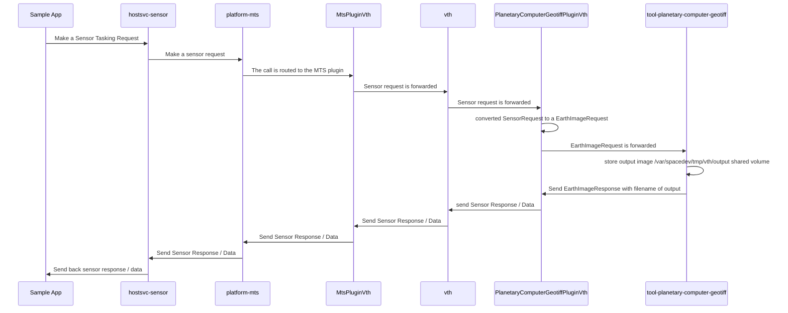

# Azure Orbital Space SDK Architecture

The Azure Orbital Space SDK is a microservices platform that abstracts spacecraft telemetry and sensor data to provide a common interface for satellite operators and payload application developers to use data collected in-orbit.

An application could conceivably be written once to the Azure Orbital Space SDK APIs and run on any spacecraft that has the Azure Orbital Space SDK installed, allowing for reuse of the application across many flavors and families of satellite hardware and telemetry and sensor data sources.

## Architecture Diagram

In the diagram below, you'll see three components that illustrate the utility of the Azure Orbital Space SDK.

1. **The Azure Orbital Space SDK**

    From the developer's perspective, you develop strongly-typed applications using the Client Libraries interact with spacecraft data on-orbit in a generic way using the Host Services.

    Visit the **[Client Libraries](./components/client-libraries.md)** documentation for more information on what packages are available to payload application developers.

    Visit the **[Host Services](./components/host-services.md/)** documentation for more information on what data and capabilities are available to payload application developers.

1. **The spacecraft and its sensors**

    From the spacecraft's perspective, you schedule and execute payload applications and translate spacecraft telemetry and sensor data to a common format via Platform Services.

    Visit the **[Platform Services](./components/platform-services.md)** documentation for more information on what capabilities are available to Satellite Owner Operators.

1. **The Virtual Test Harness (VTH)**

    For development and test, you use the Virtual Test Harness (VTH) as a ground-based instantiation of both the Azure Orbital Space SDK and the spacecraft to develop and test your applications just as you would in-orbit.

    Visit the **[Virtual Test Harness](./components/virtual-test-harness.md)** documentation for more information on wiring up **[Data Generators](./components/virtual-test-harness.md#data-generators)** to feed your applications simulated or recorded data from storage or other sources like web services.

## Plugins

Extensibility, customization, and interoperability with a variety of spacecraft and sensors of the Azure Orbital Space SDK is achieved through the use of plugins.

Visit the **[Plugins](./components/plugins.md)** documentation for more information on what plugins are and how to author them.

## Tools

See **[Tools](../tools/tools.md)** documentation for more information on what is used to develop, and develop solutions on top of, the Azure Orbital Space SDK.

## Kubernetes Configuration

See **[Kubernetes](./kubernetes.md)** documentation for more information on how Kubernetes is configured

# What does the Azure Orbital Space SDK architecture look like for communication

Now that we've resolved many of the core challenges, what does it look like for our applications to communicate from the payload application, the whole way down to the data generator and back.

The flow is the following (you can also run the demo described here using our walkthrough for [dotnet](https://github.com/microsoft/Azure-Orbital-Space-SDK-QuickStarts/blob/main/tutorials/quick-start-tutorials/e2e-eo-sample-dotnet.md) or [python](https://github.com/microsoft/Azure-Orbital-Space-SDK-QuickStarts/blob/main/tutorials/quick-start-tutorials/e2e-eo-sample-python.md):

# What are plugins?

To faciliate the level of abstraction required to build our SDK, we created host services, which are docker container applications that our client libraries make requests of to interact with the hardware. Recognizing that our Satellite Owner / Operator (SOO) customers have many different requirements and needs, we make all of our services extensible by plugins.

Plugins in this case can overload the operations within the host services, platform services, and even the Virtual Test Harness (VTH), to allow for the SOO to customize what the operations inside those host services do. This provides a high level of flexibility to our SOO customers to expose functionality to their customers.

# What is Message Translation Service (MTS)?

The key element of communication between the payload app computer, and the underlying CnDH is the implementation of the Message Translation Service (MTS). The MTS is the point by which the messages coming from the payload app, and then host services can communicate with the spacecraft. By funnelling requests through the MTS we create an easy point for the Satellite Owner / Operators (SOOs) to interact with their own APIs for the CnDH. This interaction is done via a plugin.

# What is Helm?

Helm is the application package manager for Kubernetes that you use to standardize and simplify the deployment of cloud-native applications on Kubernetes. It can also be descirbed as the package manager for Kubernetes. Helm makes it easier for us to package and deploy software on a Kubernetes cluster using charts.

Overall Helm allows for us to be more flexible and tailor it to the enviornment as needed. All while becoming more advanced.

# Kubernetes

Our Microsoft Azure Orbital Space SDK is a series of microservices running as pods in Kubernetes (k3s).  We use 4 namespaces:

- Core (core)
- Platform Services (platformsvc)
- Host Services (hostsvc)
- Payload Apps (payloadapp)

Traffic flow between the microservices is depicted below:

The key takeaways for the above diagram:

- Each microservice and app has a dedicated SMB share via Core-FileServer (Xfer and Plugins)
  - Hostsvc-Link has an additional admin share in Core-FileServer to faciliate file transfers between apps
- Payload Apps access the Host Services via MQTT
  - Payload Apps are blocked from accessing Platform Services
- Host Services access Platform Services via MQTT
- All MQTT exchanges are facilitated by dapr via Core-Switchboard
  - Dapr is auto-injected and configured by the Microsoft Azure Orbital Space SDK
- A Local Container Registry called "core-registry" is deployed and configured to act as an image source for Kubernetes
  - Core-BuildService can be used to locally build container images with apps and functionality
    - i.e. Dotnet, Python v3.9, Python v3.10, OpenCV, TensorFlow, etc. (SOO Dependent)
- VTH is only available in Development and Integration Testing.  VTH is not available in orbit
