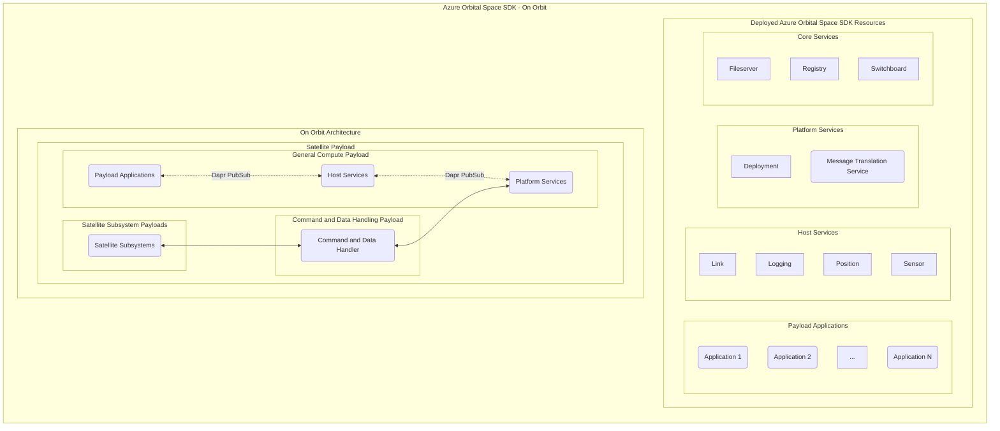
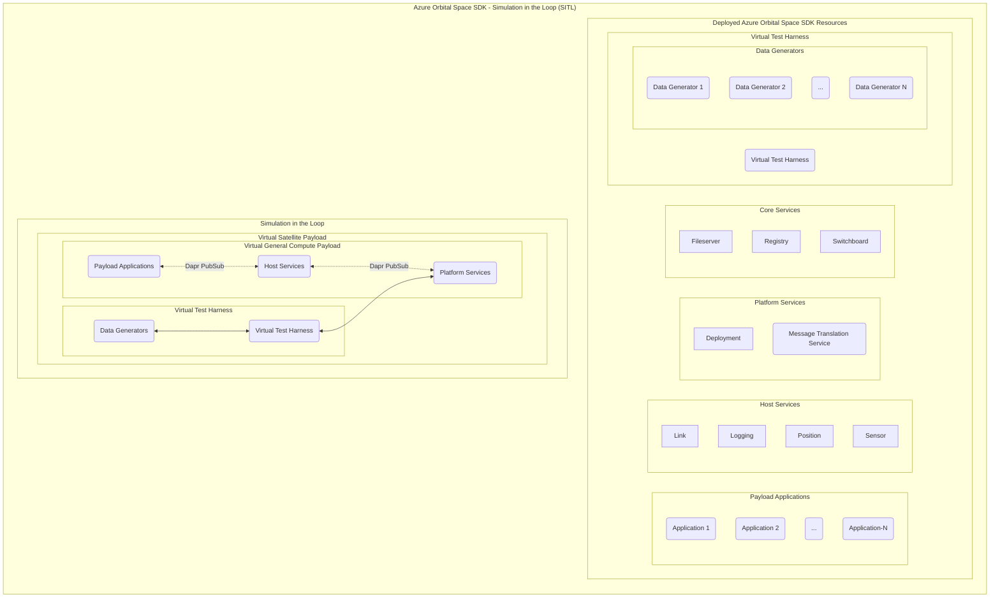
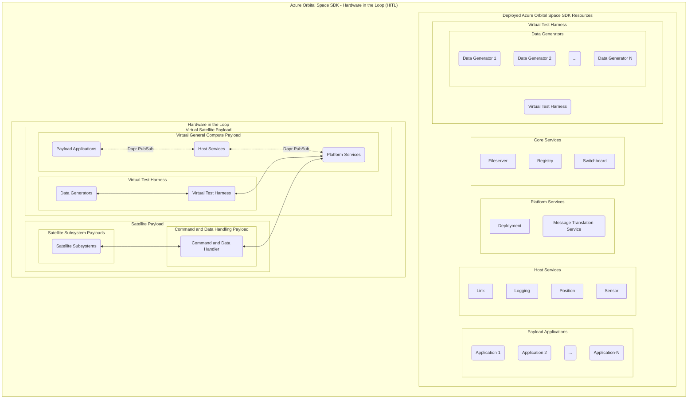
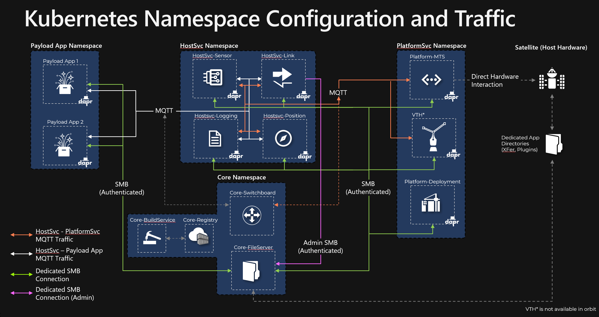

# Azure Orbital Space SDK Architecture

The Azure Orbital Space SDK consists of two primary components - a software development kit and a runtime framework.

## Software Development Kit

The software development kit...

## Runtime Framework

The runtime framework is a collection of microservices that run in a Kubernetes cluster. We provide the infrastructure to create and manage this cluster along with other supporting tools.

## High-Level Architecture Diagram

In the mermaid diagram below, you'll see three components that illustrate the utility of the Azure Orbital Space SDK.

### On Orbit

### Virtual Test Harness (VTH)

#### Simulation in the Loop (SITL)

#### Hardware in the Loop (HITL)

## Kubernetes Services

In production, on orbit contexts we deploy the following services.

### Production Services

| Service Name                          | Service Type          | Kubernetes Pod Name    | Kubernetes Namespace |
| :------------------------------------ | :-------------------- | :--------------------- | :------------------- |
| **Filserver**                         | Core Service          | core-fileserver        | core                 |
| **Registry**                          | Core Service          | core-registry          | core                 |
| **Switchboard**                       | Core Service          | core-switchboard       | core                 |
| **Message Translation Service (MTS)** | Platform Service      | platformsvc-mts        | platformsvc          |
| **Deployment**                        | Platform Service      | platformsvc-deployment | platformsvc          |
| **Sensor**                            | Host Service          | hostsvc-sensor         | hostsvc              |
| **Link**                              | Host Service          | hostsvc-link           | hostsvc              |
| **Logging**                           | Host Service          | hostsvc-logging        | hostsvc              |
| **Position**                          | Host Service          | hostsvc-position       | hostsvc              |
| _One or More Payload Applications_    | _Payload Application_ | _payloadapp-*_         | _payloadapp_         |

<!-- TODO: Replace bold with links to repos -->

Most of these services are also deployed with a [Dapr Sidecar (daprd)](https://docs.dapr.io/concepts/dapr-services/sidecar/) so that they may communicate with one another. One or more payload application may also be deployed to this cluster via the deployment service.

In development and tests contexts, we additionally deploy the Azure Orbital Space SDK Virtual Test Harness (VTH).

### Development and Test Services

| Service Name                   | Service Type     | Kubernetes Pod Name    | Kubernetes Namespace |
| :----------------------------- | :--------------- | :--------------------- | :------------------- |
| **Virtual Test Harness (VTH)** | VTH              | vth                    | ???                  |
| _One or More Data Generators_  | _Data Generator_ | ???                    | ???                  |

### Kubernetes Namespace Configuration and Traffic

The key takeaways for the above diagram:

- Each microservice and app has a dedicated SMB share via Core-FileServer (Xfer and Plugins)
  - Hostsvc-Link has an additional admin share in Core-FileServer to faciliate file transfers between apps
- Payload Apps access the Host Services via MQTT
  - Payload Apps are blocked from accessing Platform Services
- Host Services access Platform Services via MQTT
- All MQTT exchanges are facilitated by dapr via Core-Switchboard
  - Dapr is auto-injected and configured by the Microsoft Azure Orbital Space SDK
- A Local Container Registry called "core-registry" is deployed and configured to act as an image source for Kubernetes
  - Core-BuildService can be used to locally build container images with apps and functionality
    - i.e. Dotnet, Python v3.9, Python v3.10, OpenCV, TensorFlow, etc. (SOO Dependent)
- VTH is only available in Development and Integration Testing.  VTH is not available in orbit