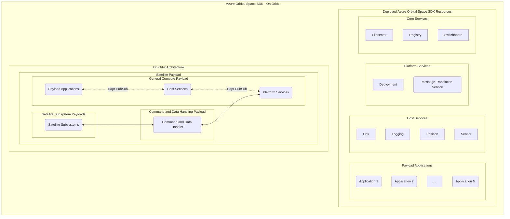

# Azure Orbital Space SDK Architecture Overview

The Azure Orbital Space SDK consists of a runtime framework and a software development kit. Payload application developers use the software development kit to create applications... The runtime framework provides ...

## Runtime Framework

The runtime framework is a collection of microservices that run in a Kubernetes cluster. We provide the infrastructure to create and manage this cluster along with other supporting tools.

[Azure Orbital Space SDK Runtime Framework](./runtime-framework/runtime-framework.md)

## Software Development Kit

The Azure Orbital Space SDK software development kit is a comprehensive collection of tools, libraries, code samples, and other resources to facilitate development on the Azure Orbital Space SDK runtime framework. Additionally, the software development kit provides extensive documentation with API references, tutorials, and samples so that developers can quickly and efficiently build applications for the Azure Orbital Space SDK runtime framework.The SDK is designed to support developers at every stage, making it easier to create and deploy space-based applications.

[Azure Orbital Space SDK Software Development Kit](./software-development-kit/software-development-kit.md)