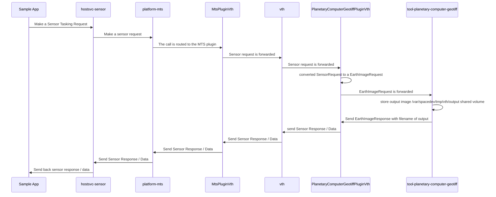

# What does the Azure Orbital Space SDK architecture look like for communication

Now that we've resolved many of the core challenges, what does it look like for our applications to communicate from the payload application, the whole way down to the data generator and back.

The flow is the following (you can also run the demo described here using our walkthrough for [dotnet](https://github.com/microsoft/Azure-Orbital-Space-SDK-QuickStarts/blob/main/tutorials/quick-start-tutorials/e2e-eo-sample-dotnet.md) or [python](https://github.com/microsoft/Azure-Orbital-Space-SDK-QuickStarts/blob/main/tutorials/quick-start-tutorials/e2e-eo-sample-python.md):

<!-- TODO: Move this content into appropriate locations elsewhere in this repo and delete this file -->