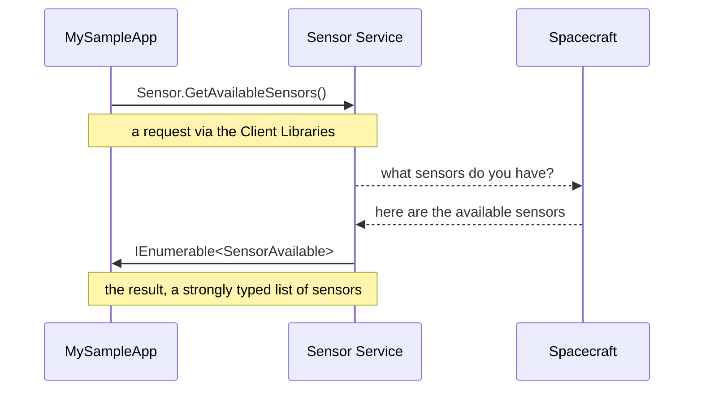

# Client Libraries

Client Libraries are the APIs payload applications use to interact with spacecraft generically via the [Host Services](./host-services.md).

The value the client libraries provide is a "write-for-one, extend-to-many" model for payload applications, making applications reusable and valuable for many different satellites.

The Azure Orbital Space SDK provides client libraries for

- the **[.NET Azure Orbital Space SDK Client Library](https://github.com/microsoft/Azure-Orbital-Space-SDK-Client-Library-dotnet)** for writing applications that interact with spacecraft in C#.

- the **[Python Azure Orbital Space SDK Client Library](https://github.com/microsoft/Azure-Orbital-Space-SDK-Client-Library-python)** for writing applications that interact with spacecraft using Python.

## Design

The client libraries provide a strongly typed interface to the Host Services.

The Host Services give the payload applications interactions with spacecraft without having to know the details of the services nor the spacecraft or its hardware.

For example, the client libraries provide a strongly typed interface to the **[Sensor Service](https://github.com/microsoft/Azure-Orbital-Space-SDK-Host-Services/tree/main/hostsvc-sensor)** that payload applications can use to subscribe to spacecraft telemetry for sensor data:

Using .NET:

```xml
// Add a reference to the Microsoft Azure Orbital Space SDK Nuget Package
<PackageReference Include="Microsoft.Azure.SpaceFx.SDK" Version="0.10.0-a" />
```

```csharp
using Microsoft.Azure.SpaceFx.SDK;

namespace MySampleApp {
  public class Program {
    public static void Main(string[] args){
      // Initialize the Microsoft Azure Orbital Space SDK
      Client.Build();

      // Query for the available sensors
      var availableSensors = Microsoft.Azure.SpaceFx.SDK.Sensor.GetAvailableSensors().Result;
      foreach (var sensor in availableSensors.Sensors) {
            logger.LogInformation("...Sensor ID '{0}' available", sensor.SensorID);
      }
    }
  }
}
```

or Python:

```python
# import the Azure Orbital Space SDK client library
import microsoft.azure.spacefx.client as client
import microsoft.azure.spacefx.sensor as sensor

# create a client and use the Sensor service to get available sensors
client.initialize('my-sample-app')
sensors_available = sensor.get_available_sensors()
```

At a high level, this flow looks like the below diagram:


