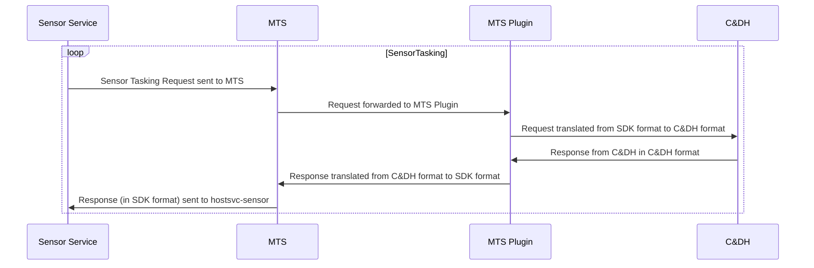
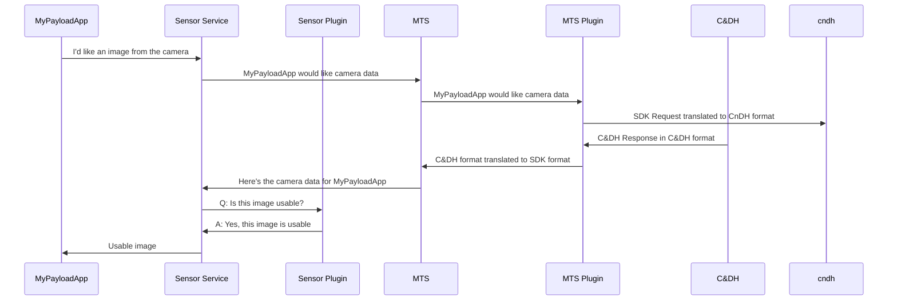
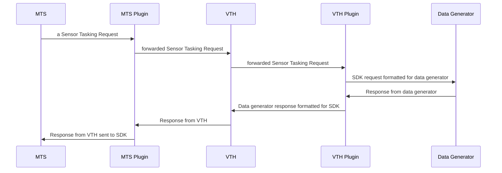

# Plugins

Every spacecraft is different. There are differences not just between different Satellite Owner Operators (SOO), but in the numerous spacecraft on orbit around Earth and beyond.

The Azure Orbital Space SDK adapts to this ever-changing landscape by providing plugins that encapsulate custom logic and behavior that is required by each spacecraft and mission without having to build new custom services.

This article outlines the implementation of plugins through the Azure Orbital Space SDK, and how Satellite Owner Operators, Hardware Manufacturers, and Payload App Developers can use plugins as part of their development, test, and deployment process.

## Plugins Explained

**What is a plugin?**

A plugin is a unique package of code that can be leveraged by a host service or platform service in the Azure Orbital Space SDK to extend the out-of-the-box functionality of that service to meet a more specific need.

You can think of a plugin as a "drop-in" addition to a host or platform service. The plugin is a package of code that can be dropped into the Azure Orbital Space SDK and will be automatically discovered and loaded by the host or platform service. You can chain plugins together, creating a pipeline of functionality surfaced by the host or platform service.

**When would I need a plugin?**

Most plugins are optional. Plugins provide an extension point for Satellite Owner Operators, Hardware Manufacturers, and App Developers to extend functionality but they are not required.

The one exception is the Message Translation Service (MTS).

## Message Translation Service Plugin

The Message Translation Service (MTS) functions as the bridge between the Azure Orbital Space SDK and the underlying spacecraft hardware via the Command and Data Handling computer (or whatever API is exposed to the payload computer).

An MTS Plugin is where hardware-specific message formats are translated to and from the Azure Orbital Space SDK message format.

### MTS Plugin Diagram

Here's how a Sensor Tasking Request is processed by an MTS plugin:

The MTS Plugin is also responsible for facilitating the communication between the SDK and the Virtual Test Harness (VTH). See [Plugins and VTH](#plugins-and-vth) for more information.

## Host Service Plugins

While some of the Host Services (such as Sensor, Link, and Logging) provide baseline functionality out-of-the-box, all of the host and platform services in the Azure Orbital Space SDK support plugins as an optional extension point.

Say a payload app wants to request an image of what the spacecraft's on-board camera can see.

The base requirement is that a Satellite Owner Operator exposes the spacecraft's camera capabilities to payload applications. The Satellite Owner Operator will implement a plugin that exposes the camera's capabilities to the Sensor Service from the MTS. We described that requirement fulfilled by the [MTS Plugin Diagram](#mts-plugin-diagram) above.

Let's take that scenario one-step further. Say we implemented a plugin that ran at the sensor service layer to check the amount of cloud coverage in an image to see if it is useful.  That flow would look like this:

This cloud detection Sensor Service Plugin grants the ability to give new, valuable capabilities to payload applications regardless of the sensor or camera hardware that it came from.

## Plugins and VTH

Much like our other host and platform services, the Virtual Test Harness (VTH) supports plugins.

A team might develop VTH plugins to bridge the various data generators that they may create, or might be created by other parties, without modifying any other production service or plugin.

In the below example, the VTH plugin provides customization to support a data generator without modifying the MTS plugin that might be (understandably) tightly versioned or owned by another team. Through the VTH plugin, the team can avoid introducing customizations required for test into production components:

## Plugin Developers

While the Message Translation Service (MTS) plugin is likely built by the Satellite Owner Operator (SOO), the Azure Orbital Space SDK makes it possible for hardware manufacturers (sensors or otherwise) to build plugins relating to their specific sensors, data scientists to build plugins to support their data processing, and payload application developers to build plugins to support the unique needs for testing their applications.

These plugins would likely not be built by the Satellite Owner Operators (SOO), and can be enabled through integration with the SDK, rather than having to build the integration directly into the CnDH.

Plugins can be built by many parties to support mission use cases and payload application development:

- **Satellite Owner Operators (SOO):**

    Many plugins that are built are going to integrate directly with the underlying spacecraft. For example, the MTS Plugin.

    Plugins can be offered to the SOOs customers to aide in application development with the intention of running on their spacecraft. For example, building Virtual Test Harness (VTH) plugins to integrate with SOO supplied data generators to offer to their customers the capability to test.

- **Hardware Manufacturers:**

    Hardware Manufacturers can build plugins that provide additional functionality to enhance the capabilities of their hardware, enhance data formatting (like moving from L0 to L1 for example), or interface with the Virtual Test Harness (VTH) to support application development.

- **Open Source Community:**

    It is possible for individuals or other organizations to build open source plugins that can be integrated with the Azure Orbital Space SDK. Examples of this could be plugins that support data science operations.

- **Payload-App Developers:**

    Payload App developers will leverage plugins for the Virtual Test Harness (VTH) to support their own application development. This could also include building plugins for all levels of the SDK to support testing of their applications and simulating scenarios safely on-the-ground.

## Monolithic or Decomposed

The Platform Services and Host Services support one or multiple plugins to enable developers to build plugins along functional needs and support independent versioning of those components.

Each host service is provided a plugin (as a .DLL) and a configuration file that identifies what operations of the service should be routed to the plugin.

Plugins can be chained together to support a chain of operations that are executed on a request.

You can create reusable, common components across missions or spacecraft, allowing for a modular library of plugins from a variety of sources to make it easier to provide greater integration between the Azure Orbital Space SDK and a bevy of underlying spacecraft.

## Plugin Development Languages

While plugin integration is facilitated by .NET, the plugin architecture supports two models:

- **Direct Model:** These plugins are built in C# and encapsulate the total functionality of the plugin.

- **Indirect Model:** These plugins have a shim built in C#, but can then communicate from the plugin shim with applications written in any language, and over any communication medium required.
