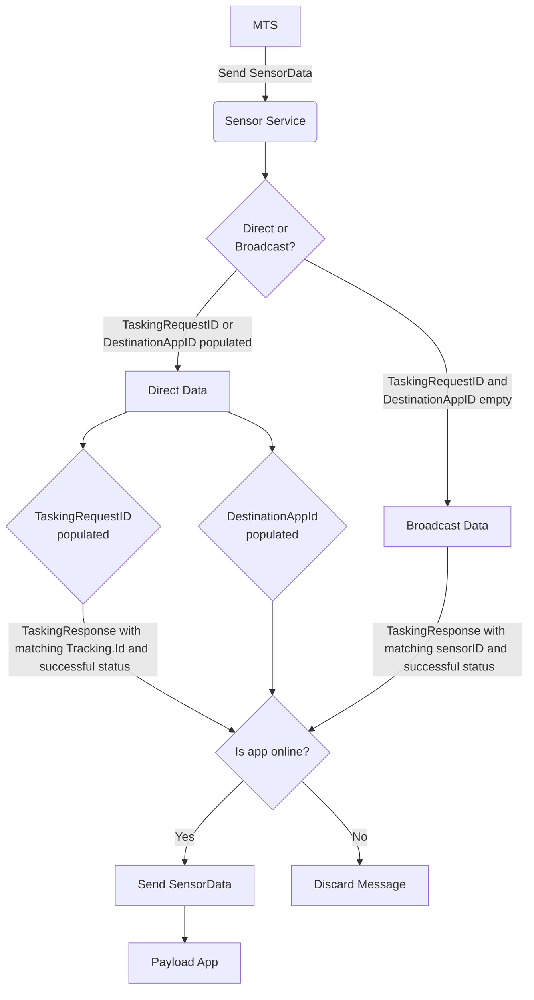

# Sensor Data Routing

The **[Sensor Service](https://github.com/microsoft/Azure-Orbital-Space-SDK-Host-Services/tree/main/hostsvc-sensor)** is responsible for handling Sensor Data routing from the **[Message Translation Service](https://github.com/microsoft/Azure-Orbital-Space-SDK-Host-Services/tree/main/platform-mts)** to the Payload Apps.  Sensor Data is one of two categories:

- **Direct**: 1 (One) Tasking Request / Response receives a dedicated Sensor Data message(s).  Examples are requesting a picture be taken, requesting secondary processing, etc.
- **Broacast**: 1 (One) Tasking Request / Response receives multiple Sensor Data messages.  Examples are current temperature of hardware, current power availability, etc.

The type of sensor data is determined by the data available in the Sensor Data message:

Sensor Data Type | DestinationAppId or <br /> TaskingTrackingId
------ | ------
**Direct**   | ✅
**Broacast**   | ❌

A Diagram of the Sensor Data flow is below ([sensor-data-routing.png](../../img/sensor-data-routing)):



## Direct Sensor Data

✅ DestinationAppId is populated or <br /> ✅ TaskingTrackingId is populated

### TaskingTrackingId is populated

Sensor Service will

- remove the DestinationAppId if it's populated
- check it's local cache for a matching *TaskingResponse.ResponseHeader.TrackingId* and a *TaskingResponse.ResponseHeader.Status* = **Successful**
  - if not found, the Sensor Data message is discarded
  - if found, updates the DestinationAppId to match the payload app that originated the TaskingRequest
- check if the app is online and if found, will route the Sensor Data directly to the app.
  - If the app is not online, the Sensor Data is discarded.

> **Note:** if both the DestinationAppId and TaskingTrackingId are populated, then the DestinationAppId is removed to force the more stringent routing rules of TaskingTrackingId to take affect.  This is done as a security measure to prevent stale / previous apps from accessing Sensor Data they may not not have access to.

> **Note:** TaskingRequests expire 24 hours after the request, or a TaskingResponse is received with a status other than **Successful**.  Apps must create a TaskingRequest a minimum of every 24 hours to receive Sensor Data.

Example Direct Sensor Data with a TaskingTrackingID populated:

```csharp
 SensorData sensorData = new() {
    TaskingTrackingId = 123-456-789,
    SensorID = "RGBCamera",
    Data = Google.Protobuf.WellKnownTypes.Any.Pack(new Google.Protobuf.WellKnownTypes.StringValue() { Value = "PictureMetaData" })
};
```

### DestinationAppId is populated

Sensor Service will

- check if the app is online and if found, will route the Sensor Data directly to the app.
  - if the app is not online, the Sensor Data is discarded.

> **Note:** Populating DesintationAppId should be avoided whenever possible as it bypasses the more secure rules of the TaskingTrackingID Flow, and requires the originating publisher to know the specific app ID of the payload app.  Payload App IDs are only static in a single deployment; recurring deployments and multiple deployments of the same app will have unique Payload App IDs to differeniate between instances of the same payload app.

Example Direct Sensor Data with a DestinationAppId populated:

```csharp
 SensorData sensorData = new() {
    DestinationAppId = "AwesomePayloadApp",
    SensorID = "RGBCamera",
    Data = Google.Protobuf.WellKnownTypes.Any.Pack(new Google.Protobuf.WellKnownTypes.StringValue() { Value = "PictureMetaData" })
};
```

## Broadcast Sensor Data

> ❌ DestinationAppId is **not** populated and <br /> ❌ TaskingTrackingId is **not** populated

Sensor service will

- check it's local cache for a matching *TaskingResponse.SensorID* and a *TaskingResponse.ResponseHeader.Status* = **Successful**
  - if not found, the Sensor Data message is discarded
- enumerate all the apps and
  - if the app is online, forwards the SensorData to the app
  - if the app is not online then skips to the next app

> **Note:** TaskingRequests expire 24 hours after the request, or a TaskingResponse is received with a status other than **Successful**.  Apps must create a TaskingRequest a minimum of every 24 hours to receive Sensor Data.

Example Broadcast Sensor Data:

```csharp
 SensorData sensorData = new() {
    SensorID = "TemperatureSensor",
    Data = Google.Protobuf.WellKnownTypes.Any.Pack(new Google.Protobuf.WellKnownTypes.StringValue() { Value = "14" })
};
```
