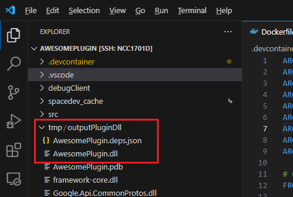

# Build Plugin Dlls (amd64 or arm64)

A Satellite Owner Operator (SOO) or Payload App Developer (PAD) may have extensibilty needs with custom Plugins that require targeting runtime environments on various CPU architectures, emulation environments and etc.. (i.e, ARM64, QEMU, etc..).

The following procedures allow for the compilation of assemblies/dlls for the deployment of Plugins to said environments.

## Prequisites

1. Install [DevContainer CLI](https://code.visualstudio.com/docs/devcontainers/devcontainer-cli#_npm-install) for the [build_plugin_dll.sh](https://github.com/microsoft/Azure-Orbital-Space-SDK-Host-Services/tree/main/env-config/dotnetdev/build/plugins/build_plugin_dll.sh) script to execute successfully. This depedency comes pre-installed if you are running this from a Azure VM built by the [demo-vm](https://github.com/microsoft/Azure-Orbital-Space-SDK-QuickStarts/tree/main/demo-vm).

    1. `sudo apt install npm`
    1. `sudo npm cache clean -f`
    1. `sudo npm install -g n`
    1. `sudo n stable`
    1. `sudo npm install -g @devcontainers/cli`

## Host & Platform Services Plugin Templates

Build steps relevant to any of the plugins for host services or platform services listed below:

* [Link Plugin Template](https://github.com/microsoft/Azure-Orbital-Space-SDK-Host-Services/tree/main/hostsvc-link#plugin-project-template)
* [Logging Plugin Template](https://github.com/microsoft/Azure-Orbital-Space-SDK-Host-Services/tree/main/hostsvc-logging#plugin-project-template)
* [Position Plugin Template](https://github.com/microsoft/Azure-Orbital-Space-SDK-Host-Services/tree/main/hostsvc-position#plugin-project-template)
* [Sensor Plugin Template](https://github.com/microsoft/Azure-Orbital-Space-SDK-Host-Services/tree/main/hostsvc-sensor#plugin-project-template)
* [Deployment Plugin Template](https://github.com/microsoft/Azure-Orbital-Space-SDK-Host-Services/tree/main/platform-deployment#plugin-project-template)
* [MTS Plugin Template](https://github.com/microsoft/Azure-Orbital-Space-SDK-Host-Services/tree/main/platform-mts#plugin-project-template)
* [VTH Plugin Template](https://github.com/microsoft/Azure-Orbital-Space-SDK-Host-Services/tree/main/vth#plugin-project-template)

## Build Plugin Dll

Start with any of the aforementioned plugin templates and complete the thru step `5. Open a new instance of Visual Studio Code in the directory of the new plugin` and stopping before step `6. Build the devcontainer` to remain on the host within the new created plugin directory. Next proceed with the following:

1. Execute [build_plugin_dll.sh](https://github.com/microsoft/Azure-Orbital-Space-SDK-Host-Services/tree/main/env-config/dotnetdev/build/plugins/build_plugin_dll.sh) within the current plugin directory. Change SERVICE_VERION and SERVICE_VERSION_SUFFIX per the version of SDK you wish to build.

    Compiling to amd64

    ```bash
    /var/spacedev/build/dotnet/build_service.sh --repo-dir ${PWD} --app-version 0.1.0 --app-version-suffix a --dll-project src/AwesomePlugin.csproj --output /var/spacedev/tmp/AwesomePlugin --architecture amd64
    ```

    Compiling to arm64

    ```bash
    /var/spacedev/build/dotnet/build_service.sh --repo-dir ${PWD} --app-version 0.1.0 --app-version-suffix a --dll-project src/AwesomePlugin.csproj --output /var/spacedev/tmp/AwesomePlugin --architecture arm64
    ```

1. You'll see the output directory with the dll created in your directory

    

1. Now, use the `file` command to inspect the cpu architecture desired

    ```bash
    file ./tmp/outputPluginDll/AwesomePlugin.dll
    ```

1. Observe the output to the Architecture identifier for the DLL.

    **output amd64**
    

    **output arm64**
    
