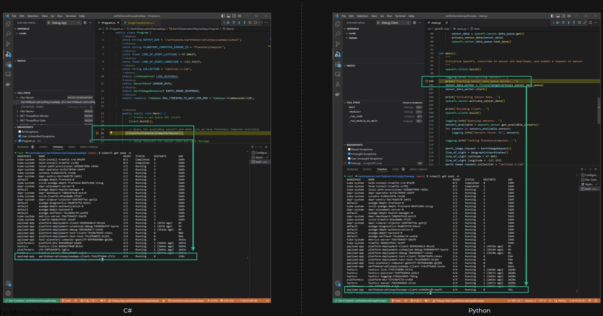
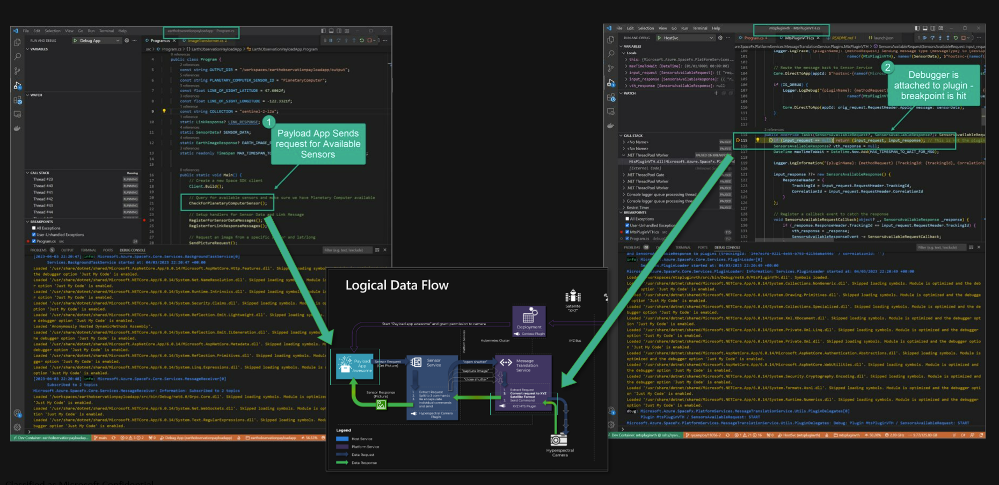

# Debug Shim

The Debugger Shim is an instance of the development container that is deployed in Kubernetes. By changing the entrypoint of the devcontainer through Kubernetes YAML commands, and a common directory between the container and pod, we can enable VSCode to remotely attach a debugger and run code from within the pod.

This, along with Kubernetes deployments and custom VSCode tasks, allow developers to write code within the DevContainer experience, but run / execute / debug within the Kubernetes Pod in a feature we call "Live Debugging".  Live Debugging reduces the differences between the developers' environment and the target production environment by empowering developers to debug code directly within Kubernetes.  This approach also allows for the entire app lifecycle to be analyzed, from app start up, app running, and app failure.

## Debug Shim Deployment

The debug shim is automatically configured and deployed as part of the devcontainer initialization cycle.  The related scripts and templates are stored in env-config and downloaded as part of the devcontainer initializeCommand and postStartCommand.  Attaching and debugging within the debug shim is preconfigured as VSCode tasks to preserve the F5 experience.

## Live debugging with kubernetes

- Faciliates live debugging in K8s by deploying service pod in non-production namespace


## Multi-instance debugging

- Enables mutli-instance debugging along with DebugClient


## Useful Commands

- Run commands in debug shim

    ``` bash
    TARGET_NAMESPACE="payload-app"
    TARGET_POD="$(kubectl get pods -n ${TARGET_NAMESPACE} -l app=${APP_NAME} --sort-by=.metadata.creationTimestamp -o jsonpath='{.items[-1]:metadata.name}')"

    kubectl exec -it  $TARGET_POD -n $TARGET_NAMESPACE -c ${APP_NAME} -- ls /
    ```

    >Note: 'APP_NAME' is an environment variable auto-populated by `/space-sdk-dev/space-sdk-dev.env`

- Get Logs for Pod

    ``` bash
    TARGET_NAMESPACE="payload-app"
    TARGET_POD="$(kubectl get pods -n ${TARGET_NAMESPACE} -l app=${APP_NAME} --sort-by=.metadata.creationTimestamp -o jsonpath='{.items[-1]:metadata.name}')"

    # From App Pod
    kubectl logs $TARGET_POD -n $TARGET_NAMESPACE -c ${APP_NAME}

    # From side car
    kubectl logs $TARGET_POD -n $TARGET_NAMESPACE -c daprd
    ```

    >Note: 'APP_NAME' is an environment variable auto-populated by `/space-sdk-dev/space-sdk-dev.env`

- Get Pod Details

    ``` bash
    TARGET_NAMESPACE="payload-app"
    TARGET_POD="$(kubectl get pods -n ${TARGET_NAMESPACE} -l app=${APP_NAME} --sort-by=.metadata.creationTimestamp -o jsonpath='{.items[-1]:metadata.name}')"
    kubectl describe pod/$TARGET_POD -n $TARGET_NAMESPACE
    ```

    >Note: 'APP_NAME' is an environment variable auto-populated by `/space-sdk-dev/space-sdk-dev.env`

- Monitor Pod Deployment

    `watch -n 1 kubectl get pods -A`

## Notes

- Redeploy/timing nuances
  - More than one "debug shim" pods can exist
  - Run the follow command to get the most recent debugshim pods

        ``` bash
        TARGET_NAMESPACE="payload-app"
        $(kubectl get pods -n ${TARGET_NAMESPACE} -l app=${APP_NAME} --sort-by=.metadata.creationTimestamp -o jsonpath='{.items[-1]:metadata.name}')
        ```
