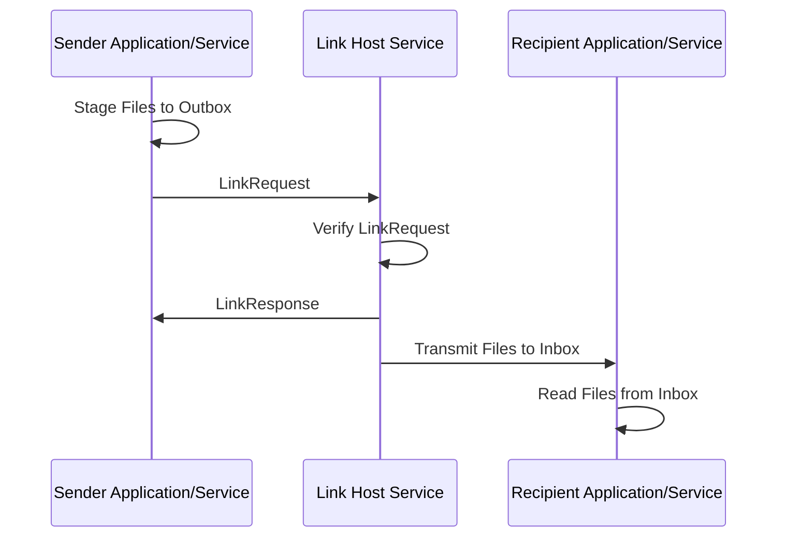

# Azure Orbital Space SDK - Link Service (hostsvc-link)

The Link Host Service facilitates seamless and secure communication links between satellite payloads and ground stations. This host service ensures reliable data transmission over space-to-ground and ground-to-space channels, supporting a wide range of mission-critical operations including telemetry data exchange, command and control operations, and payload data downlink. The link host service is also the means by which payload applications and runtime services transmit data to one another.

## Key Features

- **Reliability**: Ensures that data is securely and reliably transmitted between components, minimizing the risk of data loss or corruption.

- **Efficiency**: By automating the process of data transmission, the link host service optimizes the use of communication bandwidth and reduces the need for manual intervention.

- **Scalability**: The inbox and outbox directory model scales well with the addition of new payload applications and services, facilitating seamless integration into the satellite's operational framework.

- **Multi-Node Cluster Support**: The link host services integrates with the [Fileserver Core Service](../core-services/fileserver.md) in cases where it's needed, and leverages the local disk in cases where it isn't.

## Use Cases

- **Telemetry Downlink**: Enables the reliable transmission of telemetry data from satellite payloads to ground stations.

- **Payload Data Transmission**: Supports the efficient downlink of payload-generated data, such as Earth observation imagery or scientific measurements, ensuring timely delivery to ground-based processing facilities.

- **Sensor Data Delivery**: Serves as the mechanism by which large sensor data files are made available to payload applications.

## Link Host Service Operations and Workflows

### Link Requests

Link requests are the fundamental mechanism through which the link host service orchestrates data transmission between payload applications and runtime framework services. It's also the interface through which components of the runtime framework will stage content for downlink to a ground station. This process is designed to ensure secure, reliable, and efficient communication.

Each payload application and component within the runtime framework is equipped with two dedicated directories: an inbox and an outbox. These directories serve as the staging areas for incoming and outgoing data, respectively. On single-node Kubernetes clusters these directories are simply isolated and protected directories on disk. In the case of multi-node Kubernetes clusters, these directories take the form of an Server Message Block (SMB) file share so that content is accessible regardless of the node an application or service is running.

- **Inbox Directory**: The destination for incoming data. When the link host service processes a link request, it transfers the data from the sender's outbox to the recipient's inbox directory.

- **Outbox Directory**: When a payload application or service needs to send data, it places the data into its outbox directory, then submits a link request. This data could range from telemetry information to payload-generated content such as insights captured from Earth observation imagery.

The link host service has administrative access the inbox and outbox directories of all registered payload applications and runtime services. Upon receiving a link request, the link host service initiates a link request to transfer this data to the appropriate recipient(s). The process involves several key steps:

1. **Verification**: The link host service verifies that the content, sender, and recipient exist. The link host service also verifies that the sender has the permission to send data to the recipient. The link operation is denied if these conditions are not met.

1. **Operation Confirmation**: Upon successfully receiving the link request, the link host service provides confirmation to the sender that the request has been accepted and the link operation will be performed.

1. **Transmission**: The link host service securely transmits the data from the sender's outbox to the recipient's inbox. In the case of a downlink, the link host service transfers data from the sender's outbox to the appropriate staging area as defined by the satellite operator.

1. **Error Handling**: In the event of a transmission failure or if the recipient's inbox is unreachable, the Link Host Service implements robust error handling mechanisms. This may involve retrying the transmission or reporting a failure for further investigation.

#### Link Request Sequence Diagram



#### Link Request Examples

The following C# example demonstrates how to perform a generic link request using the Azure Orbital Space SDK .NET Client Library:

```csharp
using System.Threading.Tasks;

using Microsoft.Azure.SpaceFx;
using Microsoft.Azure.SpaceFx.MessageFormats.HostServices.Link;

Client.Build();

Task<LinkResponse> linkRequestTask = Link.SendFileToApp(
    destinationAppId: "some-app",
    file: "/outbox/some-file.png",
    overwriteDestinationFile: true
);
linkRequestTask.Wait();

LinkResponse linkResponse = linkRequestTask.Result;
```

The following Python example demonstrates how to perform a generic link request using the Azure Orbital Space SDK Python Client Library:

```python
import spacefx

spacefx.client.build()

link_response = spacefx.link.send_file_to_app(
    "some-app",
    "/outbox/some-file.png",
    overwrite_destination_file=True
)
```

> **NOTE**: See link host service documentation for the [.NET Client Library](../../software-development-kit/client-libraries/dotnet/link/link.md) or the [Python Client Library](../../software-development-kit/client-libraries/python/link/link.md) for guidance on using additional functionality to cross-link and downlink data.