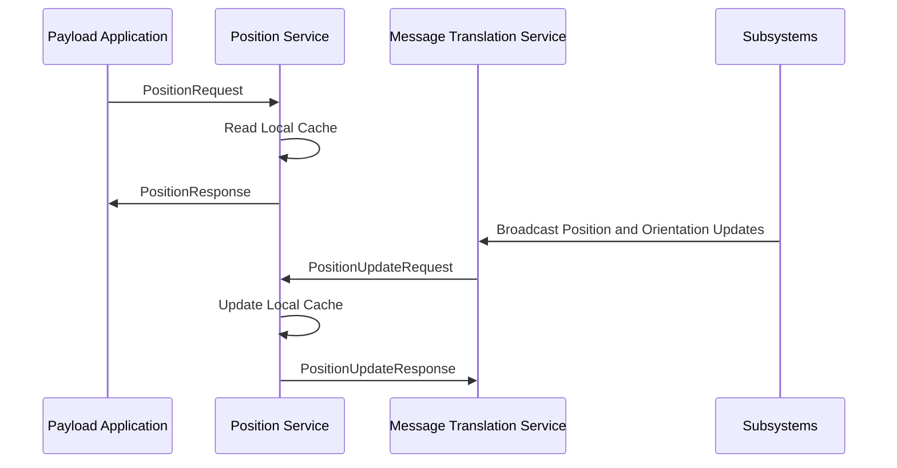

# Azure Orbital Space SDK - Position Service (hostsvc-position)

The Position Service provides current position and orientation data for satellite payloads. This service allows payload applications to track the satellite's orbit to support mission planning, navigation, and payload targeting.

## Key Features

- **Real-Time Data Access**: Provides access to the latest position and orientation data of the satellite, ensuring that payload applications have the most current information.

- **Local Cache System**: Utilizes a local cache to store the last known position and orientation, allowing for quick retrieval and eliminating the need to poll satellite subsystems for updates.

- **Asynchronous Updates**: Receives updates asynchronously through `PositionUpdateRequest` messages, ensuring the data remains current.

- **SDK Integration**: Offers easy integration with payload applications through an SDK client library, simplifying the process of requesting and receiving position data.

## Use Cases

- **Mission Planning**: Enables precise planning of satellite operations by providing accurate position and orientation data, crucial for aligning payloads and calculating orbital trajectories.

- **Payload Targeting**: Allows payload applications to accurately target their operations, whether for communication, observation, or scientific experiments, based on the satellite's current location and orientation.

## Receiving Position Data

The position service can be used by payload applications to get the last known location and orientation of the spacecraft. This process begins by the payload application sending a `PositionRequest` message to the position service through an SDK client library. Upon receiving this message the position service retrieves the last known location and orientation of the spacecraft from its internal cache, which it returns to the payload application in the form of a `PositionResponse` message.

## Updating Position Data

The position service's local cache of the last known location and orientation of the spacecraft is updated asynchronously from `PositionRequest` messages via `PositionUpdateRequest` messages sent by the Message Translation Service (MTS). The Message Translation Service interfaces with the satellite's various subsystems, including those governing guidance and navigation. As theses subsystems broadcast position and orientation updates the MTS forwards them to the SDK runtime framework by publishing a corresponding `PositionUpdateRequest` message to the position service. Upon receiving this message and updating its local cache the position service responds to MTS with a `PositionUpdateResponse` verifying receipt of the request.

## Position Data Sequence Diagram

