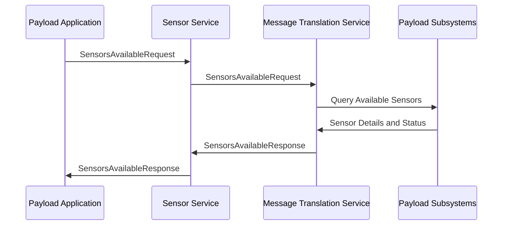
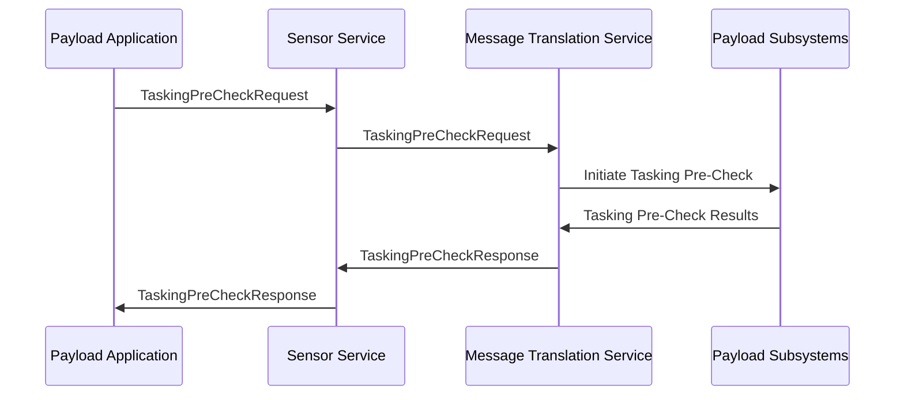

# Azure Orbital Space SDK - Sensor Service (hostsvc-sensor)

The Sensor Service provides access to the wide array of sensors onboard on the spacecraft. This service enables the efficient collection, processing, and distribution of sensor data. Thanks to its highly abstracted and generalized design, the sensor service can interface with any type of onboard sensor, whether its an imaging sensor, an altimeter, an accelerometer, or beyond.

## Key Features

- **Data Collection and Management**: Automates the collection and management of data from multiple sensor types, ensuring efficient handling of large volumes of sensor data.
- **Flexible Data Access**: Enables versatile interaction modes with sensor data, allowing users to submit jobs for asynchronous data retrieval, perform immediate queries for direct responses, or subscribe to sensor data feeds for continuous, passive updates.
- **Data Provision for Further Onboard Processing**: Provides sensor data in standardized formats that facilitates additional processing and analysis, enabling payload applications to apply their own tools to achieve their mission.

## Use Cases

- **Image Capture**: Utilize imaging sensors to capture high-resolution imagery of Earth or celestial bodies, supporting applications in mapping, surveillance, and scientific observation.
- **Data Streaming**: Facilitates continuous data streaming from sensors like accelerometers, magnetometers, and spectrometers, enabling real-time monitoring of satellite health, environmental conditions, and scientific phenomena.
- **Event-Triggered Sampling**: Employs sensors to perform event-triggered sampling, such as capturing atmospheric data when specific conditions are met, enhancing the efficiency of data collection for climate research and disaster management.
- **Remote Sensing Analysis**: Supports remote sensing analysis by providing multispectral and hyperspectral imaging data, aiding in agriculture, forestry, and land use planning.

## Sensor Availability

The sensor service can be used by payload applications to determine which sensors can be used onboard the spacecraft. This process begins by the payload application sending a `SensorsAvailableRequest` message to the sensor service through an SDK client library. Upon receiving this message, the sensor service then forwards it to the Message Translation Service (MTS) for processing. The MTS acts as the intermediary capable of communicating directly with the satellite's payload subsystems.

After receiving the request, the MTS interacts with payload subsystems to determine which sensors are currently available. This information, including sensor types, capabilities, and statuses, is then relayed back to the sensor service in the form of a `SensorsAvailableResponse`. From there, the sensor service optionally further refines this message before sending it back to the requesting payload application.

By having access to up-to-date data on which sensors are operational and available for use, payload applications can make informed decisions on how to use these sensors for data collection and other mission-critical tasks. This not only enhances the efficiency of the mission operations but also ensures that the payload applications are utilizing the spacecraft's resources effectively, thereby maximizing the overall mission success.

### Sensor Availability Sequence Diagram



## Sensor Tasking Pre-Check

Once a payload application has determined that a sensor is available, it can perform a sensor tasking pre-check to ensure the sensor is fully operational and ready to perform the desired tasking.

The process begins by the payload application sending a `TaskingPreCheckRequest` message to the sensor service through an SDK client library. Upon receiving this message, the sensor service then forwards it to the Message Translation Service (MTS) for processing. The MTS acts as the intermediary capable of communicating directly with the satellite's payload subsystems.

After receiving the request, the MTS interacts with the payload subsystems to initiate the tasking pre-check sequence on the specified sensor. The specifics of this pre-check vary from sensor to sensor, but typically involves verifying the sensor's operational status, checking for any potential conflicts with other tasks, and ensuring that all necessary resources are available to perform the specified task.

The results of this pre-check are then relayed back to the sensor service in the form of a `TaskingPreCheckResponse`. From there, the sensor service optionally further refines this message before sending it back to the requesting payload application.

### Sensor Tasking Pre-Check Sequence Diagram



### Examples

<!-- TODO: Add Python and .NET code examples -->

## Sensor Tasking

Once a payload application has determined that a sensor is available and ready for tasking, it can submit a sensor tasking request to the sensor service to perform the desired tasking.

The process begins by the payload application sending a `TaskingRequest` message to the sensor service through an SDK client library. Upon receiving this message, the sensor service then forwards it to the Message Translation Service (MTS) for processing. The MTS acts as the intermediary capable of communicating directly with the satellite's payload subsystems.

After receiving the request, the MTS interacts with the payload subsystems to initiate the tasking sequence on the specified sensor. Upon confirmation that the sensor has received the tasking request, the MTS then responds to the sensor service with a `TaskingResponse` message. This message does not contain sensor tasking output, but rather the status of submitting the tasking request to the sensor itself. From there, the sensor service optionally further refines this message before sending it back to the requesting payload application.

Output from sensor tasking is returned in the form of one or more `SensorData` messages, which is discussed further in the [Sensor Data](#sensor-data) section below.

### Sensor Tasking Sequence Diagram


> **Note:** One or more `SensorData` messages may be returned as the result of sensor tasking.

### Examples

<!-- TODO: Add Python and .NET code examples -->

## Sensor Data

The sensor service orchestrates the flow of data from sensors to payload applications, leveraging the Message Translation Service (MTS) for seamless data translation and routing between the runtime framework and the satellite payload. Sensor data can be routed in one of two ways, direct and broadcast routing.

### Direct Sensor Data Routing

For specific tasking requests, such as capturing an image or conducting secondary processing, the sensor service ensures that data is directly routed to the requesting application. This is facilitated by the presence of `DestinationAppId` or `TaskingTrackingId` in the `TasingRequest` message.

- **TaskingTrackingId**: When populated, the sensor service prioritizes this for routing, removing any `DestinationAppId` if present. The sensor service verifies the request against its local cache for a matching `TaskingResponse` with a successful status. If a match is found, sensor data is routed to the originating application. Sensor data is discarded of the originating application is no longer present in the runtime framework.

- **DestinationAppId**: If `TaskingTrackingId` is not present, sensor data is routed directly to this application ID. Sensor data is discarded of the application is not present in the runtime framework. This method is less secure than using `TaskingTrackingId` and is recommended only when the specific application ID is both known and static.

> **Note:** if both the `DestinationAppId` and `TaskingTrackingId` are populated, then `DestinationAppId` is removed to force the more stringent routing rules of `TaskingTrackingId` to take affect.  This is done as a security measure to prevent stale applications from accessing sensor data they are not permitted to interact with.

### Broadcast Sensor Data Routing

When neither `DestinationAppId` nor `TaskingTrackingId` is populated, the sensor service broadcasts the data to all applications that have subscribed to the data feed. The sensor service checks its cache for any matching `TaskingResponse` with a successful status, and broadcasts the sensor data to the corresponding applications. Sensor data is not forwarded to applications that are no longer present in the runtime framework.

> **Note:** `TaskingRequests` expire after 24 hours, or when another corresponding `TaskingResponse` is received with a status other than `Successful`. Long-running payload applications must create a new `TaskingRequest` every 24 hours to continue receiving sensor data. This is done to prevent data overflow and ensure that only active and relevant payload applications receive sensor data.

### Sensor Data Routing Flow Diagram

The routing logic is depicted in the diagram below, illustrating the decision-making process for directing sensor data to payload applications.


### Examples

<!-- TODO: Add Python Examples -->

#### Direct Sensor Data

A TaskingTrackingId is used to request a specific action, such as capturing imagery. The sensor service ensures the data is routed directly to the requesting application, provided it is online.

```csharp
SensorData sensorData = new() {
    TaskingTrackingId = 123-456-789,
    SensorID = "RGBCamera",
    Data = Google.Protobuf.WellKnownTypes.Any.Pack(new Google.Protobuf.WellKnownTypes.StringValue() { Value = "PictureMetaData" })
};
```

#### Broadcast Sensor Data

Sensor data without a specific destination is broadcasted to all online applications, ensuring widespread data dissemination for general monitoring or analysis.

```csharp
SensorData sensorData = new() {
    SensorID = "TemperatureSensor",
    Data = Google.Protobuf.WellKnownTypes.Any.Pack(new Google.Protobuf.WellKnownTypes.StringValue() { Value = "14" })
};
```

<!-- TODO: Finish this documentation -->