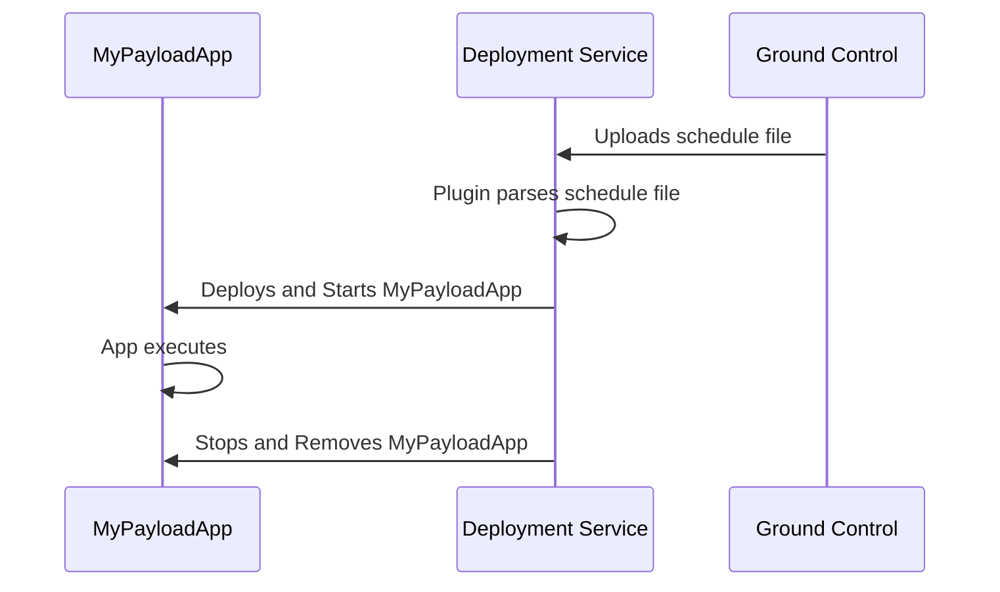
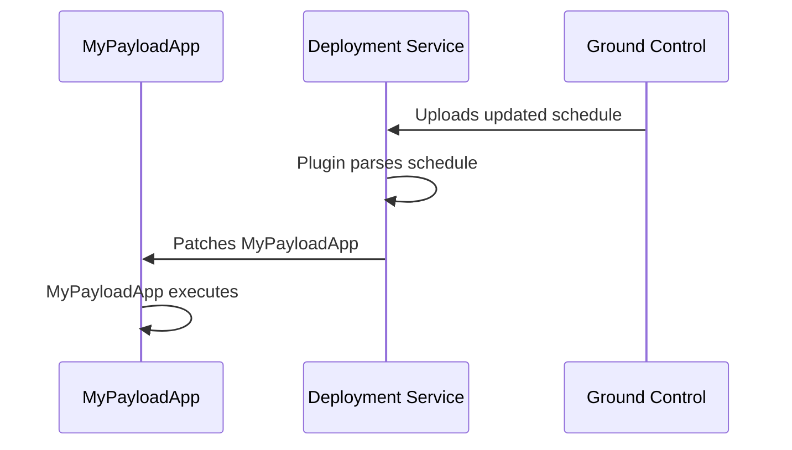

# Azure Orbital Space SDK - Deployment Service

The Deployment Service is tasked with the deployment, scheduling, and management of payload applications on the spacecraft. This service adapts to the unique hosting architectures and platforms through the use of customizable plugins.

## Key Features

## Use Cases

## Getting Started

### Deployment

### Configuration

<!-- TODO: Finish this documentation -->

## Overview

To illustrate the Deployment Service's functionality, consider the process of deploying and initiating a payload application by a Satellite Owner Operator from ground control. The sequence diagrams below provide a visual representation of this process, highlighting the critical role of the Deployment Service in managing the lifecycle of payload applications on the spacecraft.

For example, the deployment and initiation of a payload application by a Satellite Owner Operator from ground control is depicted below:

The Deployment Service exclusively handles the deployment, initiation, and updating of payload applications, ensuring a streamlined and secure process for Satellite Owner Operators. The flow diagram below outlines the process of updating an application on orbit:

