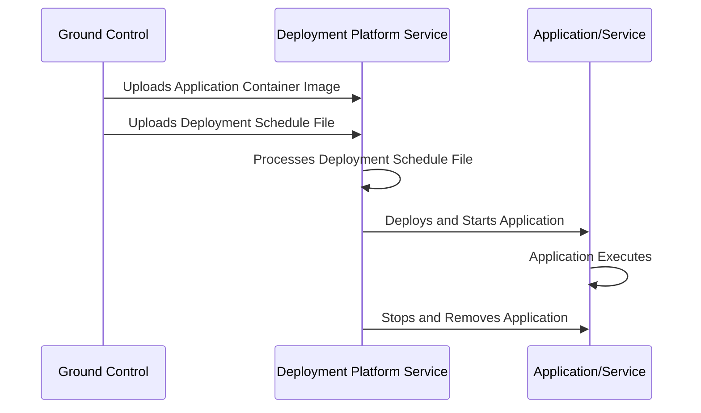
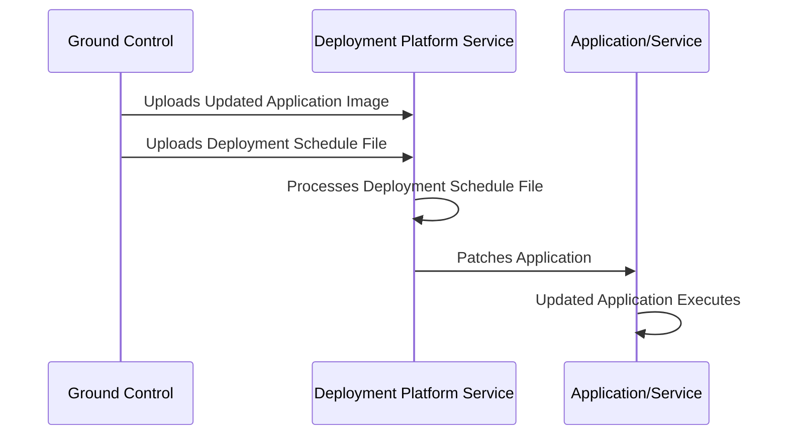

# Azure Orbital Space SDK - Deployment Service (platform-deployment)

The [Deployment Platform Service](https://github.com/microsoft/azure-orbital-space-sdk-platform-deployment) is tasked with the deployment, scheduling, and management of payload applications and services on the spacecraft. It may also be used to update applications and services in-place. This functionality of the deployment platform service is especially important when performing a full update of the runtime framework, as it allows each component to be patched without downtime.

## Key Features

- **Automated Deployment and Management**: Automates the deployment and management of payload applications and services on the spacecraft, ensuring efficient and secure operations.

- **In-Place Updates**: Supports in-place updates of applications and services, allowing for seamless patches and upgrades without downtime, crucial for maintaining continuous operations.

- **Authoritative Scheduling**: Empowers ground control with authoritative scheduling capabilities, enabling precise control over the deployment and update timings of applications and services.

- **Rolling Updates**: Implements rolling updates for applications and services, ensuring minimal disruption and continuous operation during updates.

- **Lifecycle Management**: Manages the entire lifecycle of applications and services from deployment to removal based on predefined schedules.

## Use Cases

- **Payload Application Deployment**: Facilitates the deployment of scientific and commercial payload applications, ensuring they are launched and operational at the designated times.

- **Operational Software Updates**: Enables the timely and secure update of operational software components aboard the spacecraft, ensuring they remain up-to-date with the latest features and security patches.

- **Runtime Framework Maintenance**: Supports the maintenance and update of the spacecraft's runtime framework, allowing for the addition of new features and the patching of existing components without interrupting ongoing operations.

- **Application Management**: Allows for the deployment and management of mission-specific applications, providing the flexibility to adapt the spacecraft's capabilities to various mission requirements.

- **Emergency Patch Deployment**: In the event of critical vulnerabilities or issues, the service can rapidly deploy patches to affected applications and services, mitigating risks and ensuring the continued safety and functionality of the spacecraft.

## Deployment Platform Service Operations and Workflows

### Deploying an Application or Service

The deployment process for an application or service, as illustrated in the sequence diagram below, begins with ground control uploading the container image for the application or service to be deployed. This is then followed by an upload of a deployment schedule file, which contains applications lifecycle metadata used by the deployment platform service.

After processing the schedule file, the deployment platform service proceeds to deploy and start the application at its scheduled deployment time. Upon completion of the application, or at the application's scheduled time of removal, the deployment platform service stops and removes the application from the runtime framework.

This streamlined process ensures that applications and services are deployed efficiently and securely, and with authoritative scheduling from ground control.

### Updating an Application or Service

The process of updating and existing application or service executing within the runtime framework is virtually identical to that of deploying a new application or service.

The process begins with ground control uploading an updated application container image, followed by a deployment schedule file to the deployment platform service. The deployment platform service then processes the schedule file, which contains detailed metadata on when to perform the update.

Once the scheduled update time has transpired, the deployment platform services executes a rolling update by patching the application or service. This ensures continuous operation of the application or service and minimizes system disruption. Like the act of deploying an application or service, updates to the runtime framework are done efficiently and securely, and with authoritative scheduling from ground control.

<!-- TODO: Add examples of schedules files and explain their parameters -->