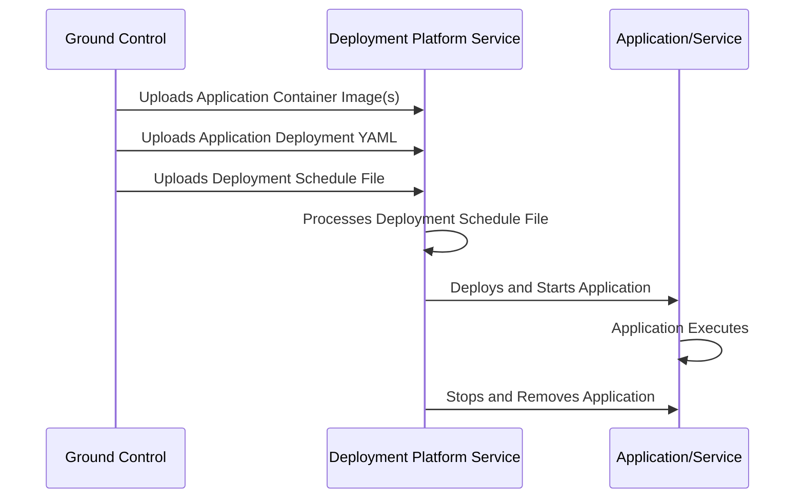
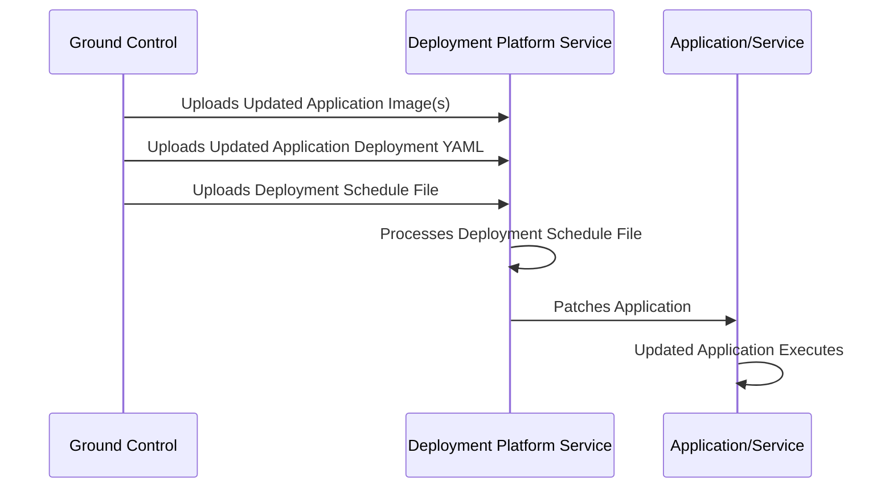

# Azure Orbital Space SDK - Deployment Service (platform-deployment)

The [Deployment Platform Service](https://github.com/microsoft/azure-orbital-space-sdk-platform-deployment) is tasked with the deployment, scheduling, and management of payload applications and services on the spacecraft. It may also be used to update applications and services in-place. This functionality of the deployment platform service is especially important when performing a full update of the runtime framework, as it allows each component to be patched without downtime.

## Key Features

- **Automated Deployment and Management**: Automates the deployment and management of payload applications and services on the spacecraft, ensuring efficient and secure operations.

- **In-Place Updates**: Supports in-place updates of applications and services, allowing for seamless patches and upgrades without downtime, crucial for maintaining continuous operations.

- **Authoritative Scheduling**: Empowers ground control with authoritative scheduling capabilities, enabling precise control over the deployment and update timings of applications and services.

- **Rolling Updates**: Implements rolling updates for applications and services, ensuring minimal disruption and continuous operation during updates.

- **Lifecycle Management**: Manages the entire lifecycle of applications and services from deployment to removal based on predefined schedules.

## Use Cases

- **Payload Application Deployment**: Facilitates the deployment of scientific and commercial payload applications, ensuring they are launched and operational at the designated times.

- **Operational Software Updates**: Enables the timely and secure update of operational software components aboard the spacecraft, ensuring they remain up-to-date with the latest features and security patches.

- **Runtime Framework Maintenance**: Supports the maintenance and update of the spacecraft's runtime framework, allowing for the addition of new features and the patching of existing components without interrupting ongoing operations.

- **Application Management**: Allows for the deployment and management of mission-specific applications, providing the flexibility to adapt the spacecraft's capabilities to various mission requirements.

- **Emergency Patch Deployment**: In the event of critical vulnerabilities or issues, the service can rapidly deploy patches to affected applications and services, mitigating risks and ensuring the continued safety and functionality of the spacecraft.

## Deployment Platform Service Operations and Workflows

### Deploying an Application or Service

The deployment process for an application or service, as illustrated in the sequence diagram below, begins with ground control uploading the container image(s) for the application or service to be deployed. The application's deployment YAML is then uploaded, which defines a [Kubernetes Deployment](https://kubernetes.io/docs/concepts/workloads/controllers/deployment/) that specifies the application infrastructure to be deployed. This is then followed by an upload of a deployment schedule file, which contains applications lifecycle metadata used by the deployment platform service.

After processing the schedule file, the deployment platform service proceeds to deploy and start the application at its scheduled deployment time. Upon completion of the application, or at the application's scheduled time of removal, the deployment platform service stops and removes the application from the runtime framework.

This streamlined process ensures that applications and services are deployed efficiently and securely, and with authoritative scheduling from ground control.



### Updating an Application or Service

The process of updating and existing application or service executing within the runtime framework is virtually identical to that of deploying a new application or service.

The process begins with ground control uploading updated application container image(s) and an updated application deployment YAML (if required). This is then followed by the upload of a deployment schedule file to the deployment platform service. The deployment platform service then processes the schedule file, which contains detailed metadata on when to perform the update.

Once the scheduled update time has transpired, the deployment platform services executes a rolling update by patching the application or service. This ensures continuous operation of the application or service and minimizes system disruption. Like the act of deploying an application or service, updates to the runtime framework are done efficiently and securely, and with authoritative scheduling from ground control.



## The Application Deployment YAML

The application deployment YAML is any [Kubernetes Deployment](https://kubernetes.io/docs/concepts/workloads/controllers/deployment/) specification that is compatible with the cluster hosting the runtime framework. This YAML could be as simple as the deployment of a single pod running the application container image, or a multi-pod deployment with supporting infrastructure depending on the needs and complexity of your application.

### Basic Single-Pod Deployment YAML Example

This section provides a YAML example for deploying a basic single-pod application using Kubernetes. It defines a deployment named `busybox` within the `payload-app` namespace.

The deployment is configured to create a single replica of a pod labeled `busybox`. The pod runs a container based on the `busybox:1.28` image. The container's main process is a shell command that sleeps for `10000` seconds, effectively keeping the container running without performing any active tasks.

```yaml
apiVersion: apps/v1
kind: Deployment
metadata:
  name: busybox
  namespace: payload-app
  labels:
    app: busybox
spec:
  replicas: 1
  selector:
    matchLabels:
      app: busybox
  template:
    metadata:
      labels:
        app: busybox
    spec:
      containers:
      - name: busybox
        image: busybox:1.28
        imagePullPolicy: IfNotPresent
        command: ["/bin/sh"]
        args: ["-c", "sleep 10000"]
```

### Advanced Multi-Pod Deployment YAML Example

This section presents a YAML configuration for a more complex Kubernetes deployment named `advanced-app` within the `payload-app` namespace. It outlines a deployment strategy to manage two containers within a single pod: one running an Nginx server (`nginx:alpine`) and the other running a Redis server (`redis:alpine`).

The deployment is configured to maintain two replicas of this pod, ensuring high availability and load distribution. Each container exposes its respective default port, with Nginx on port `80` and Redis on port `6379`, facilitating network access to both services within the pod.

```yaml
apiVersion: apps/v1
kind: Deployment
metadata:
  name: advanced-app
  namespace: payload-app
  labels:
    app: advanced-app
spec:
  replicas: 2
  selector:
    matchLabels:
      app: advanced-app
  template:
    metadata:
      labels:
        app: advanced-app
    spec:
      containers:
      - name: primary-container
        image: nginx:alpine
        ports:
        - containerPort: 80
      - name: secondary-container
        image: redis:alpine
        ports:
        - containerPort: 6379
```

## The Deployment Schedule File

### Deployment Schedule File Fields

- **RequestHeader**: Contains metadata for the deployment request.
  - **TrackingId**: A unique identifier for the deployment request.
  - **CorrelationId**: A unique identifier that correlates multiple requests into a correlated series of actions.
  - **AppId**: The unique application identifier.
  - **Metadata**: A dictionary for additional request metadata.
- **AppName**: The name of the application to be deployed.
- **NameSpace**: The Kubernetes namespace within which the application will be deployed.
- **AppGroupLabel**: A label identifying the group or owner of the application.
- **CustomerTrackingId**: A unique customer tracking identifier.
- **Schedule**: Deploy the application on a recurring schedule, defined via Cron syntax.
- **StartTime**: ?????
- **MaxDuration**: The maximum duration the application is allowed to run once started.
  - **Seconds**: The duration of the permitted runtime in seconds.
  - **Nanos**: ???
- **YamlFileContents**: The name of the YAML file containing the application's deployment configuration.
- **ContainerInjectionTarget**: ???
- **Priority**: ???
- **ApplicationContextString**: ???
- **ApplicationContextFile**: Optional field to specify additional application runtime context in the form of a file. Set to null if this is not needed.
    - **FileName**: The name of the file containing additional application context.
    - **Required**: A boolean flag indicating if this context is required to deploy the application.
- **ApplicationContextCase**: ???

### Example Deployment Schedule File - Immediate Deployment

In this example, the deployment schedule file defines a deployment of an application for immediate deployment to the `payload-app` namespace. The application comes from the `ACME` group, and will deploy the Kubernetes infrastructure defined in `example-application.yaml`. The application is permitted to run for two minutes, after which time all deployed resources will be removed.

```yaml
[
    {
        "RequestHeader": {
            "TrackingId": "",
            "CorrelationId": "57f32a53-05f4-4e9e-a03e-e9c5f60fa9d3",
            "AppId": "",
            "Metadata": {}
        },
        "AppName": "ExampleApplication",
        "NameSpace": "payload-app",
        "AppGroupLabel": "ACME",
        "CustomerTrackingId": "abc123-456-789",
        "MaxDuration": {
            "Seconds": 120,
            "Nanos": 0
        },
        "YamlFileContents": "example-application.yaml",
        "DeployAction": 0,
        "Priority": 1,
        "AppContextString": null,
        "AppContextFile": null,
        "AppContextCase": 0
    }
]
```

### Example Deployment Schedule File - Scheduled Deployment

In this example the deployment schedule file defines deployment of the same resources as the previous example, but delays starting the application until the specified time has elapsed.

```yaml
[
    {
        "RequestHeader": {
            "TrackingId": "",
            "CorrelationId": "844525b9-15a6-4226-8537-5b0fc3d43b57",
            "AppId": "",
            "Metadata": {}
        },
        "AppName": "ExampleApplicationScheduled",
        "NameSpace": "payload-app",
        "AppGroupLabel": "ACME",
        "CustomerTrackingId": "abc123-456-789",
        "StartTime": {
            "Seconds": 1684531385,
            "Nanos": 687797600
        },
        "MaxDuration": {
            "Seconds": 120,
            "Nanos": 0
        },
        "YamlFileContents": "example-application.yaml",
        "DeployAction": 0,
        "Priority": 1,
        "AppContextString": null,
        "AppContextFile": null,
        "AppContextCase": 0
    }
]
```

### Example Deployment Schedule File - Recurring Deployment

In this example the deployment schedule file defines deployment of the same resources as the previous example, but the deployment and execution of the application occurs on a recurring basis. Every five minutes the application will be redeployed, running for two minutes before being stopped and removed.

```yaml
[
    {
        "RequestHeader": {
            "TrackingId": "",
            "CorrelationId": "d321fa56-a65d-43b7-964d-b7f82489d88e",
            "AppId": "",
            "Metadata": {}
        },
        "AppName": "ExampleApplicationRecurring",
        "NameSpace": "payload-app",
        "AppGroupLabel": "ACME",
        "CustomerTrackingId": "abc123-456-789",
        "Schedule": "*/5 * * * *",
        "MaxDuration": {
            "Seconds": 120,
            "Nanos": 0
        },
        "YamlFileContents": "example-application.yaml",
        "DeployAction": 0,
        "Priority": 1,
        "AppContextString": null,
        "AppContextFile": null,
        "AppContextCase": 0
    }
]
```

### Example Deployment Schedule File - Application Context

In this example, the deployment schedule file defines immediate deployment of an application with additional context accessible to the application at runtime.

```yaml
[
    {
        "RequestHeader": {
            "TrackingId": "",
            "CorrelationId": "16f87e38-322c-4c43-b96d-c4d9ff7887b3",
            "AppId": "",
            "Metadata": {}
        },
        "AppName": "ExampleApplicationWithContext",
        "NameSpace": "payload-app",
        "AppGroupLabel": "ACME",
        "CustomerTrackingId": "abc123-456-789",
        "MaxDuration": {
            "Seconds": 120,
            "Nanos": 0
        },
        "YamlFileContents": "example-application.yaml",
        "DeployAction": 0,
        "Priority": 1,
        "AppContextString": {
            "AppContext": "Lorem ipsum"
        },
        "AppContextFile": {
            "FileName": "someFile.json",
            "Required": false
        },
        "AppContextCase": 14
    }
]
```


<!-- TODO: Finish this doc -->