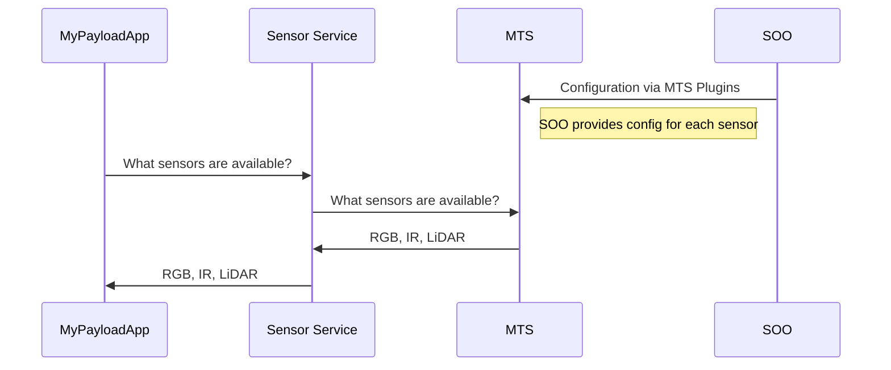

# Azure Orbital Space SDK - Message Translation Service (MTS)

At the core of platform services, the Message Translation Service (MTS) plays a vital role in converting telemetry and sensor data from the spacecraft into a universally understandable format. Leveraging protocol buffers and gRPC, it ensures smooth data exchange the Azure Orbital Space SDK runtime framework and the satellite payload.

Given the unique data interface of each Satellite Owner Operator, ranging from UDP broadcasting to FTP servers, the Message Translation Service employs plugins to translate various protocols into the expected protocol buffers format, transmitted via gRPC.

## Key Features

## Use Cases

## Getting Started

### Deployment

### Configuration

<!-- TODO: Finish this documentation -->

## Overview

To provide a clearer understanding of how MTS integrates within the Azure Orbital Space SDK ecosystem, consider the following scenario: querying the spacecraft for available sensors. The sequence diagram below visualizes the interaction between a payload application, the Sensor Service, MTS, and the Satellite Owner Operator's configuration settings.

This example highlights MTS's role in facilitating communication across different components of the spacecraft's data handling and processing systems:

