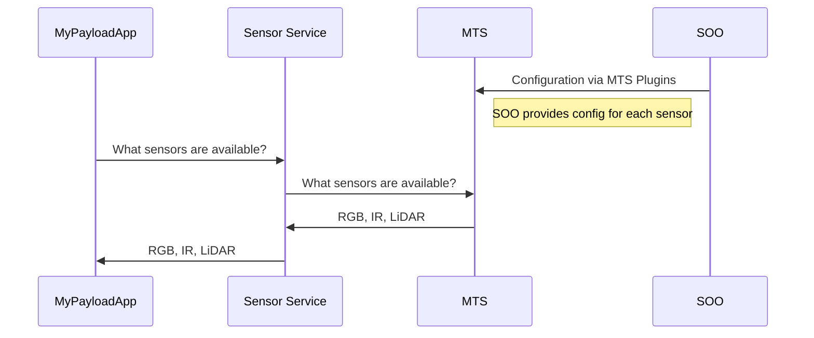

# Azure Orbital Space SDK - Message Translation Service (MTS)

At the core of platform services, the Message Translation Service (MTS) plays a vital role in converting telemetry and sensor data from the spacecraft into a universally understandable format. Leveraging protocol buffers and gRPC, it ensures smooth data exchange the Azure Orbital Space SDK runtime framework and the satellite payload.

Given the unique data interface of each Satellite Owner Operator, ranging from UDP broadcasting to FTP servers, the Message Translation Service employs plugins to translate various protocols into the expected protocol buffers format, transmitted via gRPC.

## Key Features

## Use Cases

## Getting Started

### Deployment

### Configuration

<!-- TODO: Finish this documentation -->

## Overview

For instance, the process for querying available sensors on the spacecraft is illustrated below:

