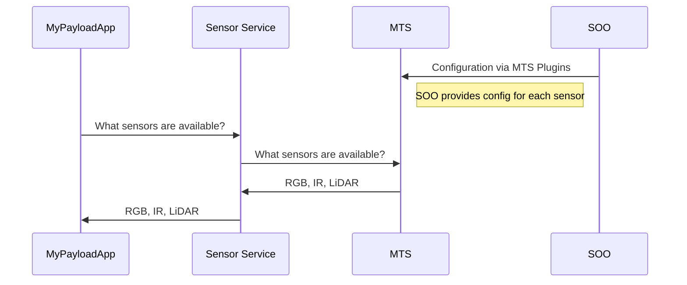
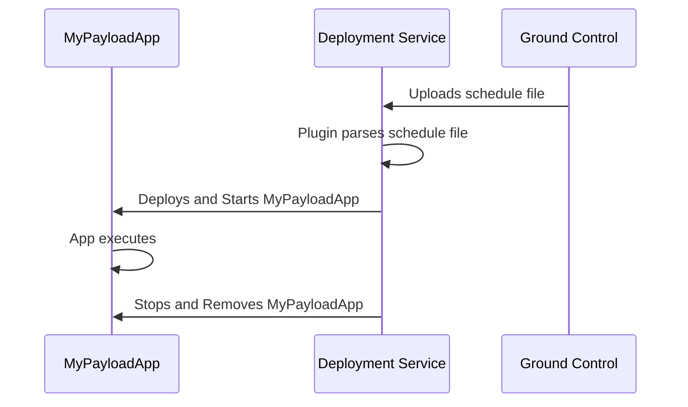
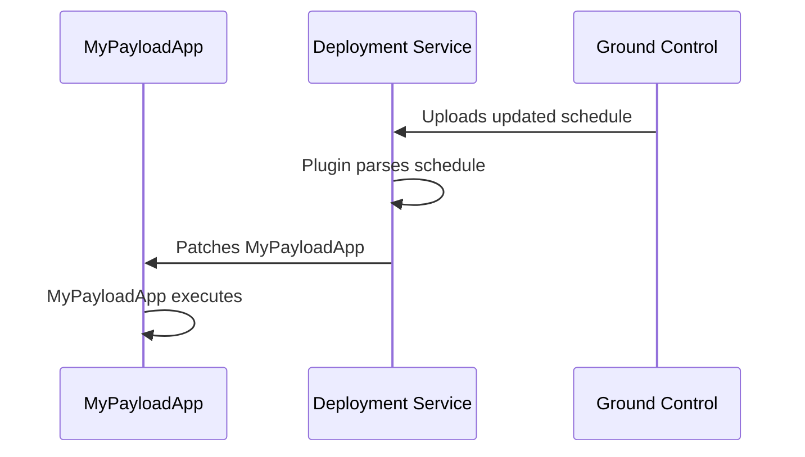

# Azure Orbital Space SDK - Platform Services

Platform Services serve as the foundational microservices layer, directly interfacing with spacecraft hardware to abstract complex on-board operations such as data translation and scheduling. These services offer a unified interface for both payload applications, through Host Services, and Satellite Owner Operators, streamlining interactions with the spacecraft's systems.

Positioned closer to the spacecraft's hardware, Platform Services provide a critical layer of abstraction, simplifying the complexities of spacecraft operations for Satellite Owner Operators and payload applications.

Due to their integral role and the need for secure operations, Platform Services are exclusively managed by Satellite Owner Operators. They are segregated from payload applications and Host Services within Kubernetes namespaces to ensure logical isolation and operational integrity.

The Azure Orbital Space SDK enriches Satellite Owner Operators with essential Platform Services, including:

- **[Message Translation Service (MTS)](https://github.com/microsoft/Azure-Orbital-Space-SDK-Host-Services/tree/main/platform-mts)**: Facilitates the conversion of telemetry and sensor data from spacecraft-specific formats to a standardized format.
- **[Deployment Service](https://github.com/microsoft/Azure-Orbital-Space-SDK-Host-Services/tree/main/platform-deployment)**: Manages the deployment, updating, and termination of payload applications on the spacecraft.

## Extensibility and Customizations

The Azure Orbital Space SDK's plugin system offers extensive opportunities for customizing and extending the functionalities of Platform Services to cater to specific mission requirements.

For detailed information on plugins, see **[Plugins](../plugins.md)**.

## Design

Platform Services are pivotal in managing application deployments, scheduling operations, and facilitating seamless interaction with the spacecraft's Command and Data Handling (C&DH) computer.

### Message Translation Service (MTS)

At the core of platform services, the Message Translation Service (MTS) plays a vital role in converting telemetry and sensor data from the spacecraft into a universally understandable format. Leveraging protocol buffers and gRPC, it ensures smooth data exchange the Azure Orbital Space SDK runtime framework and the satellite payload.

Given the unique data interface of each Satellite Owner Operator, ranging from UDP broadcasting to FTP servers, the Message Translation Service employs plugins to translate various protocols into the expected protocol buffers format, transmitted via gRPC.

For instance, the process for querying available sensors on the spacecraft is illustrated below:

### Deployment Service

The Deployment Service is tasked with the deployment, scheduling, and management of payload applications on the spacecraft. This service adapts to the unique hosting architectures and platforms through the use of customizable plugins.

For example, the deployment and initiation of a payload application by a Satellite Owner Operator from ground control is depicted below:

The Deployment Service exclusively handles the deployment, initiation, and updating of payload applications, ensuring a streamlined and secure process for Satellite Owner Operators. The flow diagram below outlines the process of updating an application on orbit:

