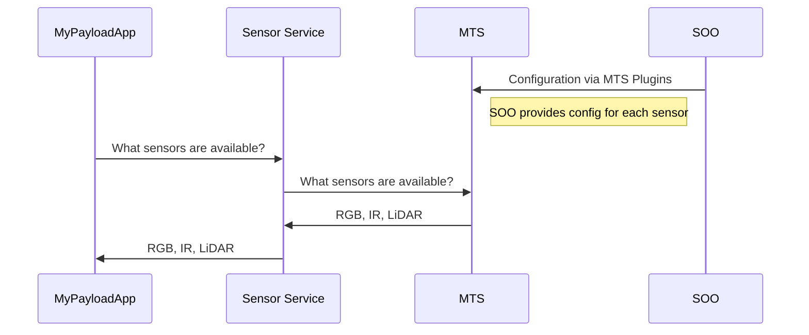
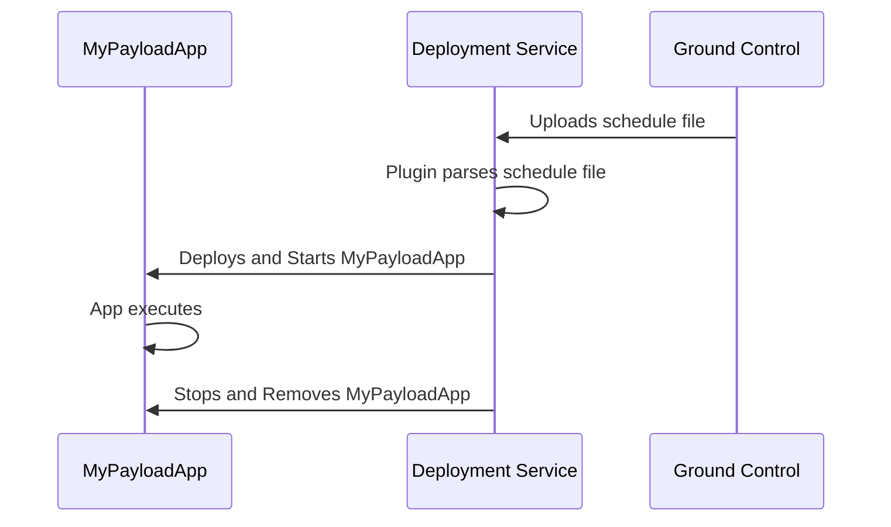
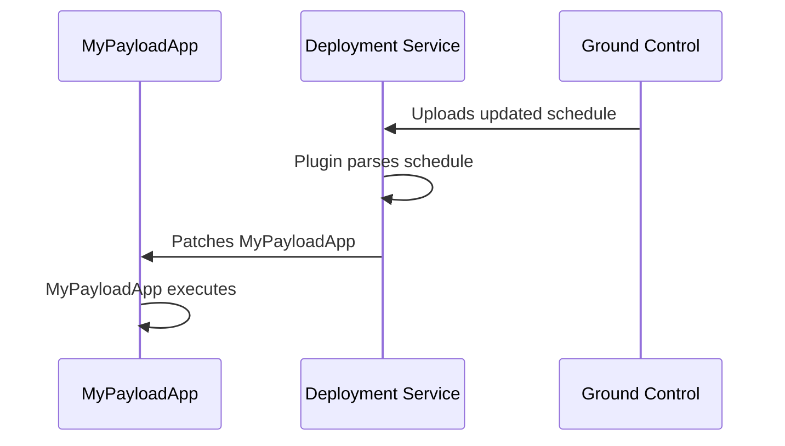

# Platform Services

Platform Services are microservices that abstract on-board concerns like data translation and scheduling, giving payload applications (via the [Host Services](../host-services/)) and Satellite Owner Operators a common interface to interact with the spacecraft.

A Platform Service is a layer of abstraction nearer to the spacecraft and its hardware than the Host Services.

For those reasons, Platform Services are managed and interacted with exclusively by the Satellite Owner Operator (SOO) and  are logically isolated from the payload applications and Host Services by Kubernetes namespaces.

The Azure Orbital Space SDK Platform Services provide Satellite Owner Operators with:

- the **[Message Translation Service](https://github.com/microsoft/Azure-Orbital-Space-SDK-Host-Services/tree/main/platform-mts)** to translate telemetry and sensor data from the spacecraft to a common format
- the **[Deployment Service](https://github.com/microsoft/Azure-Orbital-Space-SDK-Host-Services/tree/main/platform-deployment)** to deploy, update, and stop payload applications

## Source

See the [Azure Orbital Space SDK Host Services](https://github.com/microsoft/Azure-Orbital-Space-SDK-Host-Services/) repository to get started with the Platform Services.

## Extensibility and Customizations

To extend and customize behavior of the Platform Services, the Azure Orbital Space SDK provides a plugin system.

See **[Plugins](../plugins.md)** for more information.

## Design

Platform Services control things like deploying applications, managing the deployment schedule or interacting with the Command and Data Handling computer.

### Message Translation

The Message Translation Service is a Platform Service responsible for translating telemetry and sensor data from the spacecraft to a common format.

Internally, the Azure Orbital Space SDK uses Protocol Buffers and gRPC as its data exchange between Host Services and payload applications.

The data interface to a spacecraft is unique to each SOO. Some use UDP broadcasting, some use file drop/retrieval, others provide FTP servers.

The MTS is responsible for translating the different protocols into Protocol Buffers transmitted by gRPC as expected by the Host Services.

For example, here's how an application might request what sensors are available on the spacecraft:

### Deployment and Scheduling

The Deployment Service is a Platform Service responsible for deploying payload applications and scheduling them to run on the spacecraft.

Deploying and starting a payload application is a complex process unique to every hosting architecture and platform. That uniqueness is specified by the Deployment Service's Plugins. See **[Plugins](../plugins.md)** for more information.

For example, here's how a Satellite Owner Operator might request an application be deployed and started from the ground:

The Deployment Service is the only place a Satellite Owner Operator deploys and starts payload applications.

Say an application needs updating, the application is also patched by the Deployment Service:

