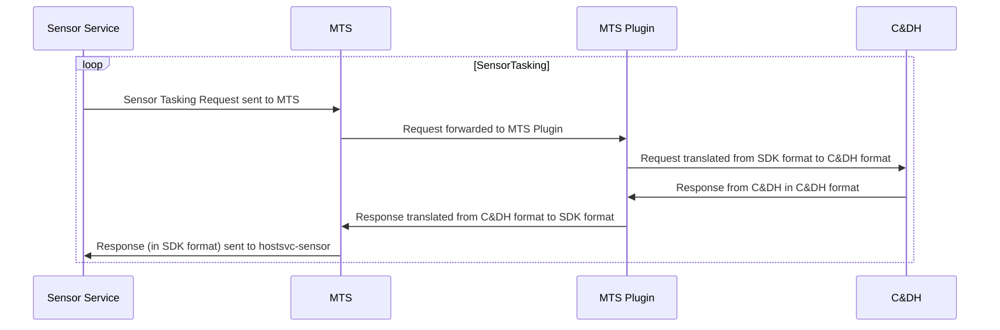
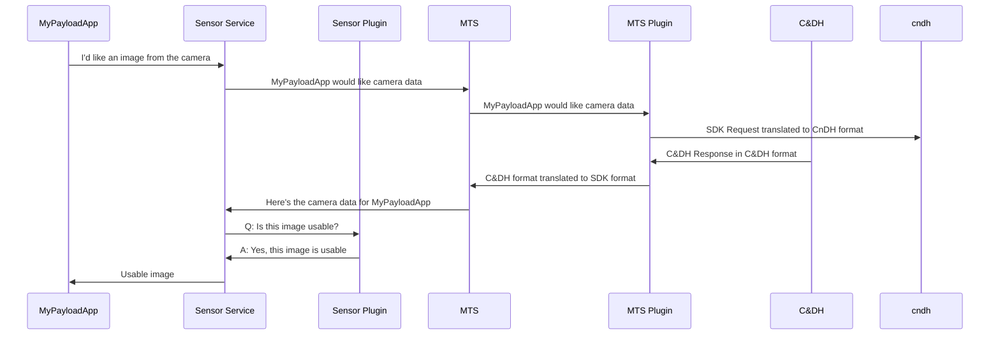
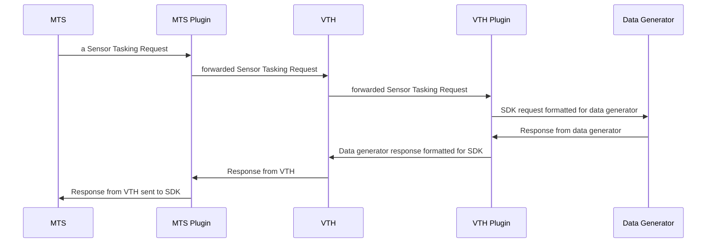

# Azure Orbital Space SDK - Plugins

In the dynamic realms of space exploration and Earth observation, each spacecraft presents a unique set of characteristics and requirements. This diversity spans across different Satellite Owner Operators (SOOs) and extends to the multitude of spacecraft orbiting Earth and venturing into the cosmos.

To navigate this ever-evolving landscape, the Azure Orbital Space SDK relies on a robust plugin architecture. These plugins encapsulate the bespoke logic and functionalities needed by each spacecraft and mission. This eliminates the need to create new services for each mission and satellite payload.

This document outlines the plugin architecture within the Azure Orbital Space SDK. It serves as a guide for Satellite Owner Operators, Hardware Manufacturers, and Payload Application Developers on leveraging plugins throughout their development, testing, and deployment efforts.

## Understanding Plugins

### What is a Plugin?

A plugin stands as a modular code package, designed to augment the core capabilities of a host or platform service within the Azure Orbital Space SDK. It acts as a seamless enhancement, easily integrated into the SDK, where it is automatically recognized and utilized by the service. Plugins can be interconnected, forming a sequence of functionalities that enrich the service's offerings.

### Why are Plugins Needed?

While the adoption of plugins remains largely optional, they offer a pivotal extension point for Satellite Owner Operators, Hardware Manufacturers, and App Developers to amplify the SDK's functionalities.

The Message Translation Service (MTS), however, requires at least one plugin that defines the interface between the Azure Orbital Space SDK Runtime Framework and the satellite payload.

## The Message Translation Service Plugin

The Message Translation Service (MTS) functions as the bridge between the Azure Orbital Space SDK and the underlying spacecraft hardware. It is responsible for converting hardware-specific message formats to and from the SDK's standard message format.

### Workflow of an MTS Plugin

The diagram below illustrates the process of handling a Sensor Tasking Request via an MTS plugin:

Additionally, the MTS Plugin facilitates SDK communication with the Virtual Test Harness (VTH), further detailed in the subsequent section.

## Enhancements via Host Service Plugins

While host services like sensor, link, and logging offer foundational functionalities, the Azure Orbital Space SDK's architecture supports plugin integration across all host and platform services to provide versatile extensibility.

For example, consider the scenario where a payload application requests imagery from the spacecraft's onboard camera. The Satellite Owner Operator must expose the camera's capabilities through a plugin to the Sensor Service so that applications within the runtime framework can interact with the sensor. This type of requirement is demonstrated in the MTS Plugin Diagram above.

Expanding on this scenario, imagine a plugin operating at the sensor service level, designed to assess cloud coverage in an image to determine if it is usable by the downstream application. The flow for this process is depicted below:

This cloud detection sensor service plugin demonstrates the SDK's capability to extend new, valuable functionalities to payload applications, irrespective of the sensor or camera hardware origin.

## Integration with the Virtual Test Harness

The Virtual Test Harness (VTH) also embraces the plugin architecture, enabling teams to develop VTH plugins that connect with various data generators without altering any production service or plugin. This approach prevents the introduction of test-specific customizations into production components, as illustrated below:

## The Ecosystem of Plugin Developers

The Azure Orbital Space SDK empowers a diverse array of developers to craft plugins tailored to their specific needs, ranging from Satellite Owner Operators and Hardware Manufacturers to Payload App Developers and the Open Source Community. This collaborative effort enriches the SDK's capabilities, facilitating a seamless integration with a wide spectrum of spacecraft systems and applications.

## Architectural Flexibility: Monolithic vs. Decomposed

The SDK's design accommodates both monolithic and decomposed approaches, allowing developers to construct plugins based on functional requirements and support independent component versioning. Each host service can be equipped with one or multiple plugins, enabling a sequence of operations to be executed upon request. This modular approach fosters the creation of a reusable, comprehensive library of plugins, enhancing the integration between the Azure Orbital Space SDK and various spacecraft systems.

## Supported Development Languages for Plugins

The Azure Orbital Space SDK's plugin architecture is designed with flexibility in mind, accommodating a variety of development languages to ensure broad compatibility and developer convenience. This design decision empowers developers from diverse backgrounds and expertise to contribute to the ecosystem, enhancing the SDK's capabilities and integration potential with spacecraft systems.

### Direct Integration Model

- **C# Core**: C# serves as the primary language for direct plugin development. This model allows developers to fully encapsulate the plugin's functionality within C#, leveraging the rich features and robustness of the .NET framework to create efficient, reliable plugins.

### Indirect Integration Model

- **C# Shim with External Communication**: For plugins requiring integration with systems or applications developed in languages other than C#, the SDK supports an indirect model. Here, a C# shim acts as an intermediary, facilitating communication between the SDK and the external application. This model is particularly useful for integrating legacy systems or leveraging specialized software written in other programming languages.

 The indirect model's design is inherently language agnostic, enabling plugins to communicate with applications written in any language. This flexibility ensures that developers can use the best tools for their specific needs, without being constrained by language compatibility issues.

 Beyond language flexibility, the indirect model supports various communication mediums, including but not limited to HTTP, gRPC, and custom protocols. This versatility allows plugins to interact with a wide array of external systems, enhancing the SDK's adaptability and utility in complex spacecraft designs.