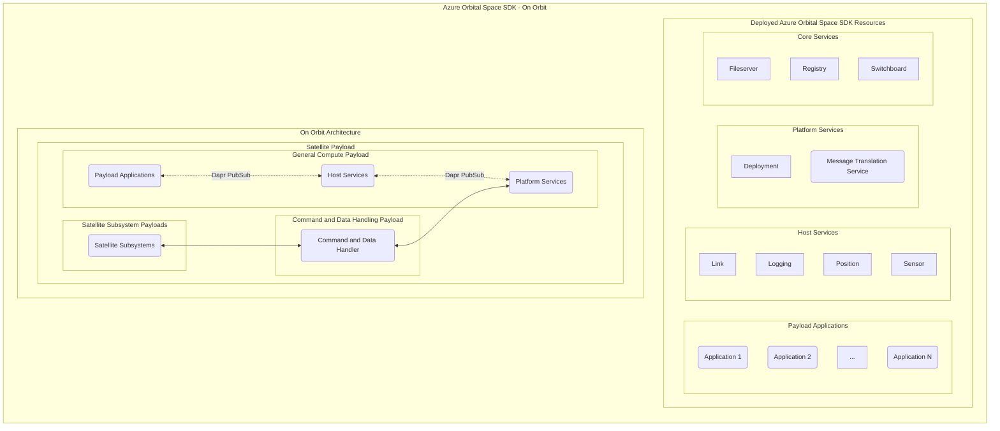

# Azure Orbital Space SDK - Runtime Framework Architecture

The Azure Orbital Space SDK Runtime Framework is a comprehensive suite designed to facilitate the development, deployment, and management of space-based applications and services. At its core, the framework provides a robust architecture that supports the unique demands of on-orbit operations, ensuring that applications can perform optimally in the challenging environment of space. This document outlines the key components and architecture of the Runtime Framework, focusing on its deployment in on-orbit contexts.

Central to the Runtime Framework is its modular design, which separates functionalities into Payload Applications, Host Services, Platform Services, and Core Services. This modular approach not only enhances the scalability and flexibility of space-based applications but also simplifies the integration and management of diverse services. Each module is designed to operate seamlessly within the on-orbit architecture, providing a cohesive ecosystem for satellite operations.

The Runtime Framework leverages Kubernetes for orchestrating and managing containerized applications and services in production environments. This adoption of Kubernetes underscores the framework's commitment to reliability, scalability, and ease of deployment, making it an ideal choice for managing complex, distributed systems in space. The following sections delve into the specifics of the Runtime Framework's architecture, its components, and how they interact within the on-orbit and Kubernetes environments to support satellite missions.

## On Orbit Architecture

## Kubernetes Services

Building on the robust architecture of the Azure Orbital Space SDK Runtime Framework, the next section focuses on the Kubernetes Services that are pivotal to the deployment and management of space-based applications. These services, categorized into [Core Services](./core-services/core-services.md), [Platform Services](./platform-services/platform-services.md), and [Host Services](./host-services/host-services.md), are meticulously orchestrated within Kubernetes environments. This orchestration ensures optimal performance, scalability, and reliability of the services essential for on-orbit operations. The detailed list that follows provides an overview of each service, including its type, Kubernetes pod name, and namespace, highlighting the framework's commitment to a structured and efficient operational strategy.

### Production Services

| Service Name                                                                                | Service Type          | Kubernetes Pod Name    | Kubernetes Namespace |
| :------------------------------------------------------------------------------------------ | :-------------------- | :--------------------- | :------------------- |
| **[Filserver](./core-services/fileserver.md)**                                              | Core Service          | core-fileserver        | core                 |
| **[Registry](./core-services/registry.md)**                                                 | Core Service          | core-registry          | core                 |
| **[Switchboard](./core-services/switchboard.md)**                                           | Core Service          | core-switchboard       | core                 |
| **[Message Translation Service (MTS)](./platform-services/message-translation-service.md)** | Platform Service      | platformsvc-mts        | platformsvc          |
| **[Deployment](./platform-services/deployment.md)**                                         | Platform Service      | platformsvc-deployment | platformsvc          |
| **[Sensor](./host-services/sensor.md)**                                                     | Host Service          | hostsvc-sensor         | hostsvc              |
| **[Link](./host-services/link.md)**                                                         | Host Service          | hostsvc-link           | hostsvc              |
| **[Logging](./host-services/logging.md)**                                                   | Host Service          | hostsvc-logging        | hostsvc              |
| **[Position](./host-services/position.md)**                                                 | Host Service          | hostsvc-position       | hostsvc              |
| _One or More Payload Applications_                                                          | _Payload Application_ | _payloadapp-*_         | _payloadapp_         |

Most of these services are also deployed with a [Dapr Sidecar (daprd)](https://docs.dapr.io/concepts/dapr-services/sidecar/) so that they may communicate with one another. One or more payload application may also be deployed to this cluster via the deployment service.

In development and tests contexts, we additionally deploy the [Azure Orbital Space SDK Virtual Test Harness (VTH)](../virtual-test-harness/virtual-test-harness.md).