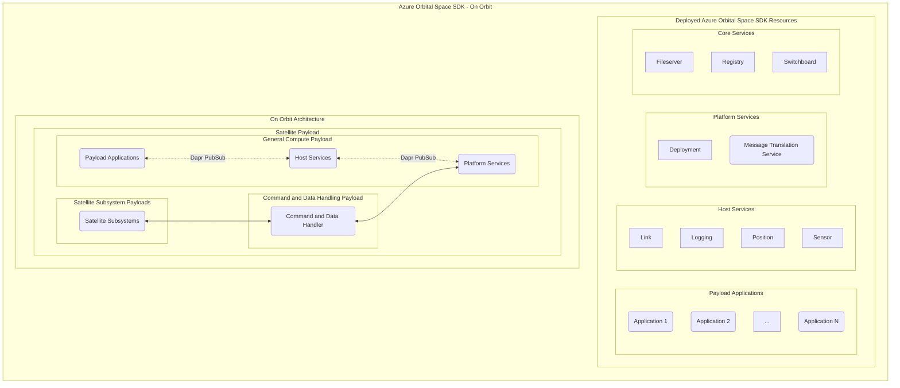
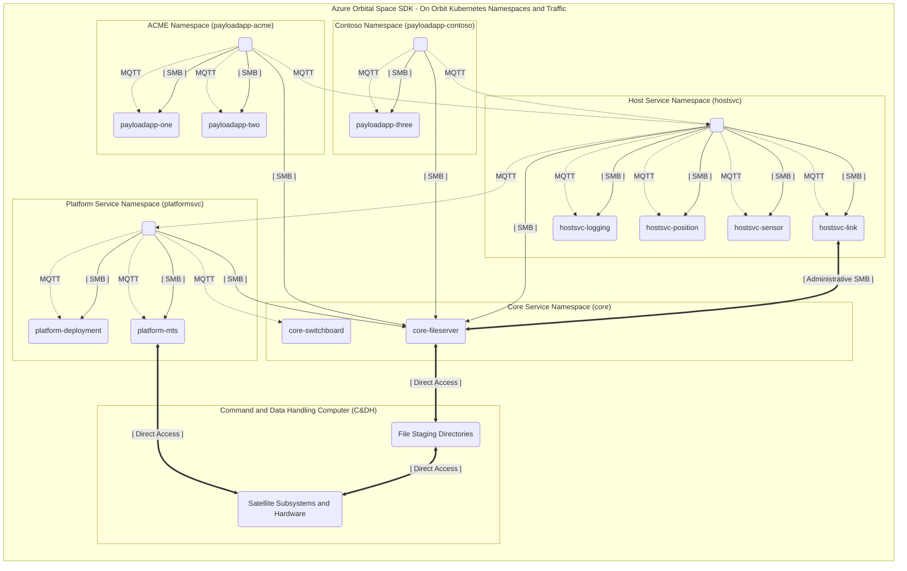

# Azure Orbital Space SDK - Runtime Framework Architecture

The Azure Orbital Space SDK Runtime Framework is a comprehensive suite designed to facilitate the development, deployment, and management of space-based applications and services. At its core, the framework provides a robust architecture that supports the unique demands of on-orbit operations, ensuring that applications can perform optimally in the challenging environment of space. This document outlines the key components and architecture of the Runtime Framework, focusing on its deployment in on-orbit contexts.

Central to the Runtime Framework is its modular design, which separates functionalities into Payload Applications, Host Services, Platform Services, and Core Services. This modular approach not only enhances the scalability and flexibility of space-based applications but also simplifies the integration and management of diverse services. Each module is designed to operate seamlessly within the on-orbit architecture, providing a cohesive ecosystem for satellite operations.

The Runtime Framework leverages Kubernetes for orchestrating and managing containerized applications and services in production environments. This adoption of Kubernetes underscores the framework's commitment to reliability, scalability, and ease of deployment, making it an ideal choice for managing complex, distributed systems in space. The following sections delve into the specifics of the Runtime Framework's architecture, its components, and how they interact within the on-orbit and Kubernetes environments to support satellite missions.

## On Orbit Architecture

## Kubernetes Services

Building on the robust architecture of the Azure Orbital Space SDK Runtime Framework, the next section focuses on the Kubernetes Services that are pivotal to the deployment and management of space-based applications. These services, categorized into [Core Services](./core-services/core-services.md), [Platform Services](./platform-services/platform-services.md), and [Host Services](./host-services/host-services.md), are meticulously orchestrated within Kubernetes environments. This orchestration ensures optimal performance, scalability, and reliability of the services essential for on-orbit operations. The detailed list that follows provides an overview of each service, including its type, Kubernetes pod name, and namespace, highlighting the framework's commitment to a structured and efficient operational strategy.

### Production Services

| Service Name                                                                                | Service Type          | Kubernetes Pod Name    | Kubernetes Namespace |
| :------------------------------------------------------------------------------------------ | :-------------------- | :--------------------- | :------------------- |
| **[Filserver](./core-services/fileserver.md)**                                              | Core Service          | core-fileserver        | core                 |
| **[Registry](./core-services/registry.md)**                                                 | Core Service          | core-registry          | core                 |
| **[Switchboard](./core-services/switchboard.md)**                                           | Core Service          | core-switchboard       | core                 |
| **[Message Translation Service (MTS)](./platform-services/message-translation-service.md)** | Platform Service      | platformsvc-mts        | platformsvc          |
| **[Deployment](./platform-services/deployment.md)**                                         | Platform Service      | platformsvc-deployment | platformsvc          |
| **[Sensor](./host-services/sensor.md)**                                                     | Host Service          | hostsvc-sensor         | hostsvc              |
| **[Link](./host-services/link.md)**                                                         | Host Service          | hostsvc-link           | hostsvc              |
| **[Logging](./host-services/logging.md)**                                                   | Host Service          | hostsvc-logging        | hostsvc              |
| **[Position](./host-services/position.md)**                                                 | Host Service          | hostsvc-position       | hostsvc              |
| _One or More Payload Applications_                                                          | _Payload Application_ | _payloadapp-*_         | _payloadapp_         |

Most of these services are also deployed with a [Dapr Sidecar (daprd)](https://docs.dapr.io/concepts/dapr-services/sidecar/) so that they may communicate with one another. One or more payload application may also be deployed to this cluster via the deployment service.

## Namespace Organization and Communication

The Azure Orbital Space SDK provides a comprehensive framework for deploying and managing microservices and applications within a Kubernetes-based environment on orbit. The architecture is designed to ensure secure, efficient, and isolated operations of various services essential for satellite operations.

The SDK organizes services into distinct Kubernetes namespaces, each serving a specific role within the satellite's operational ecosystem. The namespaces include:

- **Host Service Namespace (`hostsvc`)**: This namespace hosts critical services like `Link`, `Logging`, `Position`, and `Sensor`, which facilitate the satellite's basic operational capabilities. These services interact with both Payload and Platform Services through MQTT, mediated by the Core-Switchboard.

- **Platform Service Namespace (`platformsvc`)**: It contains services such as `Deployment` and `MTS` (Message Translation Service), which are essential for deploying applications and translating between different data formats.

- **Core Service Namespace (`core`)**: Central to the SDK, this namespace includes the `Fileserver` and `Switchboard`, providing file management and inter-service communication capabilities.

- **Isolated Payload Application Namespaces (`payloadapp-*`)**: Payload applications are deployed within dedicated namespaces tailored to each customer. As illustrated in the subsequent diagram, customers ACME and Contoso have their applications deployed in their respective namespaces (`payloadapp-acme` and `payloadapp-contoso`). This design ensures namespace isolation, preventing communication between ACME and Contoso applications while permitting intra-namespace interactions among applications belonging to the same customer.

### Key Functionalities and Interactions

- **File Sharing and Access**: Each microservice and application has access to a dedicated SMB share via `Fileserver`, facilitating file transfers and plugin exchanges. Notably, the `Link` service has additional administrative privileges on the SMB share for enhanced file transfer capabilities between applications.

- **MQTT Communication**: Payload applications access host services using MQTT, a lightweight messaging protocol, ensuring efficient and secure data exchange. This setup restricts payload applications from directly accessing platform services, maintaining a clear separation of concerns and a tight security boundary.

- **Dapr Integration**: All MQTT exchanges are facilitated by the [Dapr Sidecar (daprd)](https://docs.dapr.io/concepts/dapr-services/sidecar/), which is automatically injected and configured by the Microsoft Azure Orbital Space SDK.

- **Local Container Registry and Build Service**: The `core-registry` and `core-build` services form a pivotal part of the local container management ecosystem. The `core-registry` acts as a local container registry, providing a repository for Kubernetes to source container images for the deployment and management of services and applications. The `core-build` service enhances this by enabling on-orbit building of container images. This capability is particularly valuable as it leverages optimizations implemented within the Azure Orbital Space SDK to reuse of image layers through multi-staged build operations. This significantly reduces the amount of data that needs to be transmitted to orbit to upload a payload application or update a runtime service. Additionally, this approach optimizes disk utilization by minimizing the storage footprint of container images.

### Development and Testing Considerations

The Virtual Test Harness (VTH) is a critical tool available during the development and integration testing phases, providing a simulated environment for thorough testing of services and applications. However, it's important to note that VTH is not available in orbit, emphasizing the need for comprehensive ground-based testing to ensure reliability and functionality of the deployed services.

For more information on development and testing considerations, please visit our [Azure Orbital Space SDK Virtual Test Harness (VTH) Documentation](../virtual-test-harness/virtual-test-harness.md).