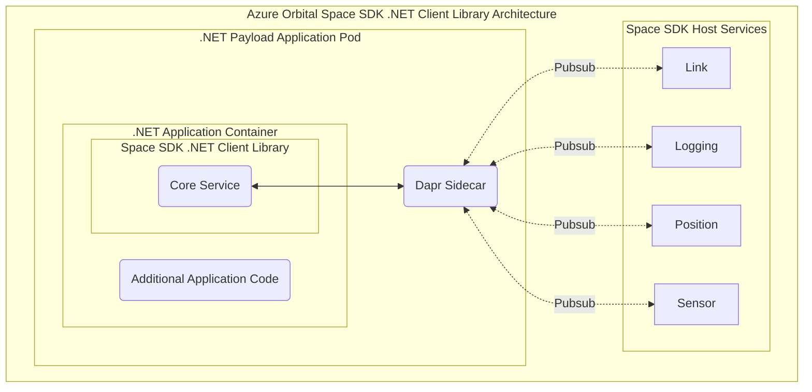

# Azure Orbital Space SDK .NET Client Library

The Azure Orbital Space SDK .NET Client Library provides developers with a comprehensive set of interfaces for interacting with satellite subsystems. This library abstracts the complexities of satellite system operation and usage, allowing you as the developer to develop innovative application without needing to know the details of the underlying satellite technology.

## Azure Orbital Space SDK .NET Client Library Architecture

The Azure Orbital Space SDK .NET Client Library integrates with the [Azure Orbital Space SDK Core Service](placeholder), which provides connectivity to the runtime framework through a [Dapr Sidecar](https://docs.dapr.io/concepts/dapr-services/sidecar/).



## Components of the Azure Orbital Space SDK .NET Client Library

Each component of the Azure Orbital Space SDK .NET Client Library plays a crucial role in simplifying interactions with the satellite. From establishing communication links to handling sensor data, these modules work together to provide a seamless experience. Below, we highlight each component of the client library.

### `Microsoft.Azure.SpaceFx.SDK`

The `Microsoft.Azure.SpaceFx.SDK` namespace serves as the core of the Azure Orbital Space SDK Python .NET Library and equips .NET developers with a broad array of tools to seamlessly interact with satellite platforms without needing to know the details of the satellite itself.

### `Microsoft.Azure.SpaceFx.SDK.Client`

The [`Microsoft.Azure.SpaceFx.SDK.Client`](./client/client.md) namespace is the core interface for instantiating and interacting with the Azure Orbital Space SDK runtime framework. It provides essential functionalities such as initializing the client itself and managing application your application's runtime configuration.

### `Microsoft.Azure.SpaceFx.SDK.Link`

The [`Microsoft.Azure.SpaceFx.SDK.Link`](./link/link.md) module provides functionalities for managing file transfers between your application host services, and other applications running within the Azure Orbital Space SDK runtime framework. It also provides methods to stage files to transfer to the ground via downlink or transfer to other satellites running the Azure Orbital Space SDK runtime framework via crosslink.

### `Microsoft.Azure.SpaceFx.SDK.Logging`

The [`Microsoft.Azure.SpaceFx.SDK.Logging`](./logging/logging.md) module provides functionality to log information and send telemetry. The logging host service has integrations with the link host service which facilitates the transfer of this data to the ground via downlinks. This allows applications to send log messages and telemetry data directly to the Azure Orbital Space SDK runtime framework, facilitating debugging and monitoring of applications and services running within the framework.

This module is essential for applications that require detailed logging and telemetry to ensure optimal performance and reliability. It supports various logging levels and telemetry metrics, enabling developers to capture and analyze detailed information about their application's behavior and performance.

### `Microsoft.Azure.SpaceFx.SDK.Position`

The [`Microsoft.Azure.SpaceFx.SDK.Position`](./position/position.md) module provides functionality for payload applications to determine the current location of a satellite. This helps facilitate applications running position-sensitive operations, such as oceanic observation.

### `Microsoft.Azure.SpaceFx.SDK.Sensor`

The [`Microsoft.Azure.SpaceFx.SDK.Sensor`](./sensor/sensor.md) module is designed to interact with various sensors on a satellite platform, providing functionalities for querying available sensors, subscribing to sensor data, and tasking sensors for specific operations.

In our sample applications these sensors are typically imaging sensors, but any systems that collects and reports a measurement could be exposed as sensor service. This could include temperature readings, radiation monitors, or magnetometers for example.

### `Microsoft.Azure.SpaceFx.MessageFormats`

The [`icrosoft.Azure.SpaceFx.MessageFormats`](protos/protos.md) module exposes the [protocol buffer (protobuf)](https://protobuf.dev/overview/) .NET language bindings for the Azure Orbital Space SDK. Protocol buffers are language-neutral, platform-neutral, extensible mechanisms for serializing structured data. They are similar to XML but smaller, faster, and simpler to use. In the context of the Azure Orbital Space SDK, protobufs are used to define the structure of data exchanged between your application and the Azure Orbital Space SDK runtime framework, ensuring strong typing and efficient data serialization.

## Using the .NET Client Library

TODO: Fill this out once the devcontainer feature is complete and starter apps are available.

### Declaring Project Dependencies

The Azure Orbital Space SDK .NET Client Library requires the following to be added to your .NET project's `.csproj`.

```xml
<PackageReference Include="Microsoft.Azure.SpaceFx.SDK" Version="0.10.0-a" />
```

### Installing the Azure Orbital Space SDK .NET Client Library

TODO: Give instructions for installing the .NET Client Library

### Updating the Azure Orbital Space SDK .NET Client Library

TODO: Give instructions for updating the .NET Client Library

## An Example .NET Payload Application

```csharp
TODO: Write a sample application
```