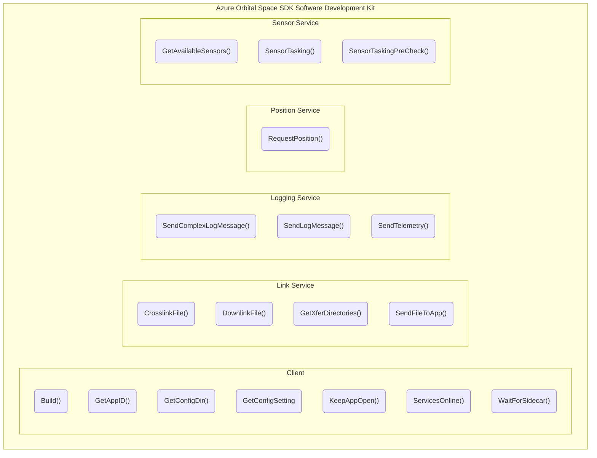

# Azure Orbital Space SDK Software Development Kit

The Azure Orbital Space SDK software development kit is a collection of tools, libraries, code samples, and other resources to facilitate development on the Azure Orbital Space SDK runtime framework.

## Overview

The Azure Orbital Space SDK, through its well-organized components and APIs, streamlines interactions with satellite systems. This cohesive collection exposes a wide range of functional capabilities including sensor data collection, secure file transfers, and application observability through advanced logging and telemetry features.

## Components

### Client

The Client APIs provide functionality to initialize and application's connection to the runtime framework and manage application resources. These methods are crucial for applications to work seamlessly within the Azure Orbital Space SDK runtime framework.

### Link Service

The Link Service APIs focus on the management of file transfers between the application and other entities. It offers capabilities for crosslinking files between satellites, downlinking files to ground stations, and sending files to other applications.

### Logging Service

The Logging Service APIs provide comprehensive logging capabilities that allow applications to transmit detailed log messages and telemetry. This service is vital for monitoring the health and performance of applications, diagnosing issues, and understanding operational trends. By offering a robust logging mechanism, it supports developers in maintaining high reliability and performance standards for their space-based applications.

### Position Service

The Position Service APIs are designed to offer precise positioning information. It allows applications to request the current position of the satellite, which is critical for navigation, tracking, and application mission planning.

### Sensor Service

The Sensor Service APIs enable direct interaction with satellite sensors, offering capabilities to query, task, and manage sensor data. This functionality is crucial for missions requiring environmental monitoring or data collection. For example, an application can task a thermal imaging sensor to capture temperature information over a specific area on Earth, then process that data for climate research or disaster response purposes.

## Implementations

The Azure Orbital Space SDK Software Development Kit is implemented in both Python and .NET, catering to a wide range of development preferences and project requirements.

Python, with its simplicity and vast ecosystem, is ideal for rapid prototyping and data analysis tasks. It allows developers to quickly integrate satellite data into applications, perform complex calculations, and develop machine learning models for predictive analytics.

.NET provides a robust framework for building scalable, high-performance applications. Its comprehensive set of libraries and tools make it a versatile choice for enterprise-level space-based application development. Additionally, .NET's interoperability with other languages makes it particularly well-suited for integrating with legacy solutions.

Together, these implementations allow application developers to choose the technology stack that best fits their needs and mission.

To learn more about either Azure Orbital Space SDK Client Library, please visit the following:

- [Azure Orbital Space SDK Python Client Library](./client-libraries/python/python-client-library.md)
- [Azure Orbital Space SDK .NET Client Library](./client-libraries/dotnet/dotnet-client-library.md)
