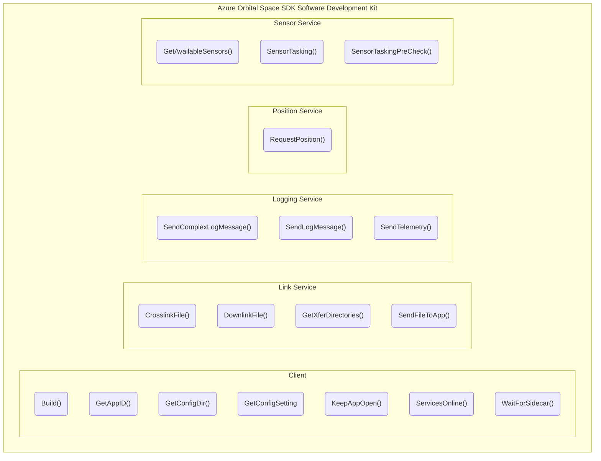

# Azure Orbital Space SDK Software Development Kit

The Azure Orbital Space SDK software development kit is a collection of tools, libraries, code samples, and other resources to facilitate development on the Azure Orbital Space SDK runtime framework.

## Client Library Overview

[Azure Orbital Space SDK Software Development Kit](./software-development-kit/software-development-kit.md)