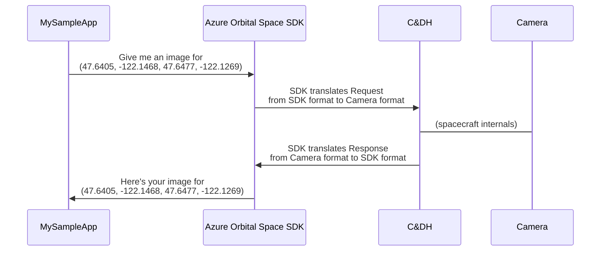
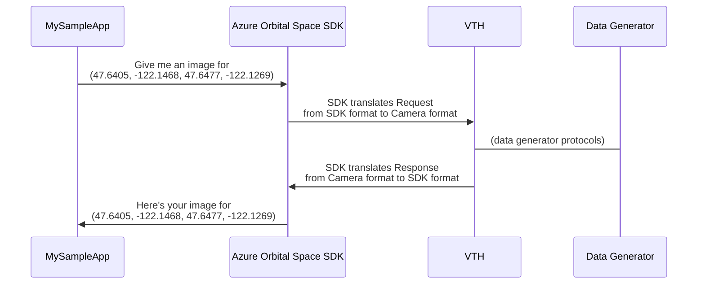
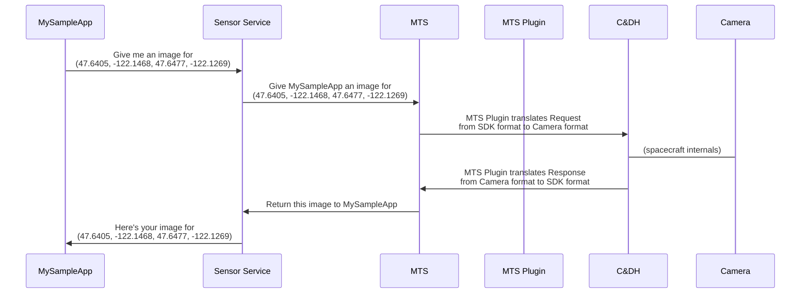
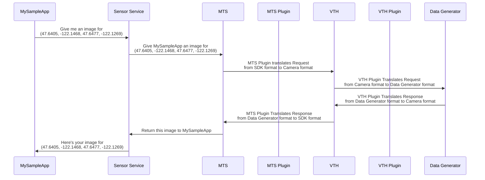

# Virtual Test Harness

Writing apps that run predictably in space can be challenging for a myriad of reasons.

In an effort to overcome those challenges from the ground, the Azure Orbital Space SDK provides a **Virtual Test Harness (VTH)** that can be used with **Data Generators** to feed your applications with information as it would be available on a spacecraft.

Some of the value the VTH and Data Generators provide:

- developers can develop and test in a predictable and repeatable fashion
- developers do not have to wait for a spacecraft to be available
- developers can replicate scenarios they would see on-orbit without code changes to their applications

## Source

### VTH

To tighten the feedback loop when developing and testing applications that will operate on orbit, the Azure Orbital Space SDK publishes:

- the **[Virtual Test Harness (VTH)](https://github.com/microsoft/Azure-Orbital-Space-SDK-Virtual-Test-Harness)** that can be used as a drop-in replacement for a spacecraft and mimic its hardware and telemetry

### Data Generators

The Azure Orbital Space SDK provides some sample data generators that you can use to test your applications or adapt for your own use:

- the **[Planetary Computer](https://github.com/microsoft/Azure-Orbital-Space-SDK-QuickStarts/tree/main/data-generators/tool-planetary-computer-geotiff)** that provides list of Planetary Computer hrefs to geotiffs for given latitude and longitude. Additional arguments enable broad queryability across collections, time ranges, and assets.

- the **[GeoTIFF Processor](https://github.com/microsoft/Azure-Orbital-Space-SDK-QuickStarts/tree/main/data-generators/tool-geotiff-processor)** that provides GeoTIFF data for a given latitude and longitude

- the **[Star Viewer](https://github.com/microsoft/Azure-Orbital-Space-SDK-QuickStarts/tree/main/data-generators/tool-star-viewer)** that generates noised 2D images of starfields for a given line-of-sight vector

The Azure Orbital Space SDK uses the term "data generator" as a generic term for any software that produces data that can be used to test an application.

A Data Generator can be an HTTP service, an FTP server, a blob container, a file on disk, or any other source of data.

## Extensibility and Customization

To adapt the Virtual Test Harness for use cases that a data generator can replicate, the Azure Orbital Space SDK provides a plugin system.

See **[Plugins](./plugins.md)** for more information.

## Design

Consider the scenario of a payload application that requests an image of the Microsoft campus from a spacecraft's camera sensor.

We'll illustrate how that might take place on orbit and how you could replicate that scenario on the ground using VTH without making code changes to your payload application.

### VTH Replacing the Spacecraft

To illustrate how and where the VTH is valuable, you'll see two simplified flows below. You'll first see the flow as it would work on-orbit, and then the flow as it would work with the VTH.

Here's a simplified example of an application requesting an image of the Microsoft campus from a spacecraft's camera sensor:

Replicating this same scenario on the ground, the VTH is a drop-in replacement for the spacecraft:

Now that we see how and where to use the VTH, let's look at how it works in detail.

### On Orbit

Compared to the rest of the Azure Orbital Space SDK, the Virtual Test Harness is an advanced topic.

Some helpful reading before diving in and implementing your own Data Generators with the VTH are the **[Plugins](./plugins.md)** (specifically the [MTS Plugin](./plugins.md#message-translation-service-plugin)) and how [Host Services](./host-services.md) interact with applications.

In this detailed version of the same on orbit example described earlier, the spacecraft's camera returns an image using its hardware-specific Camera format and the spacecraft-specific MTS Plugin translates the response to the generic SDK format before it makes it back to the calling application:

### Using the VTH

In this detailed example, again the VTH brokers the communication with the Data Generator, but the Host Services nor the application know that they're communicating with a Data Generator and not a spacecraft's camera because of the implementations of the MTS Plugin and VTH Plugin that translate SDK and Data Generator formats to and from the Camera format:

By replacing the spacecraft and its sensors with a Data Generator and the VTH, the application can be tested in a predictable and repeatable fashion. The application does not need to know that it's communicating with a Data Generator and not a spacecraft.
