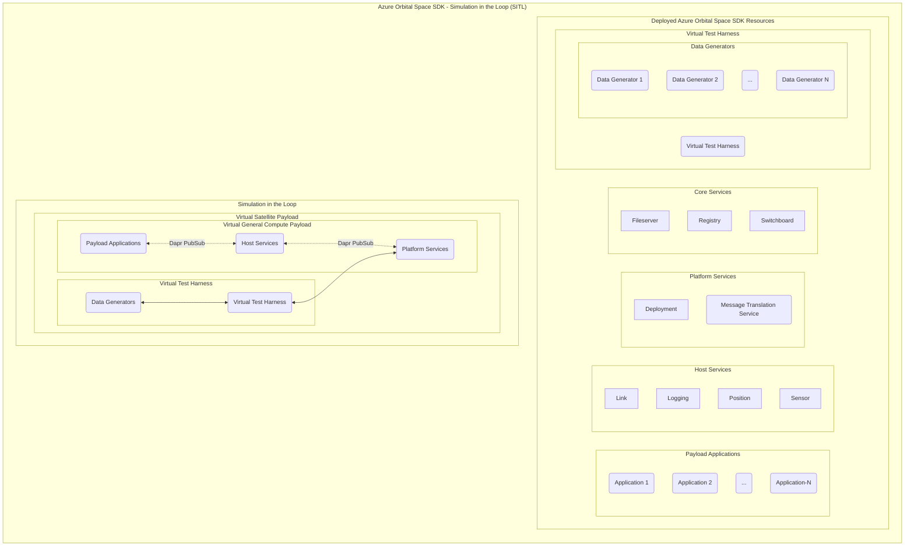
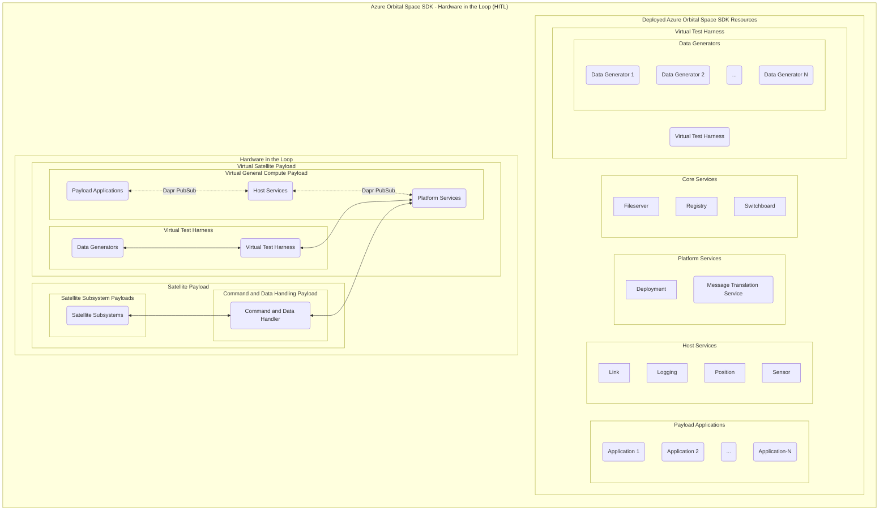
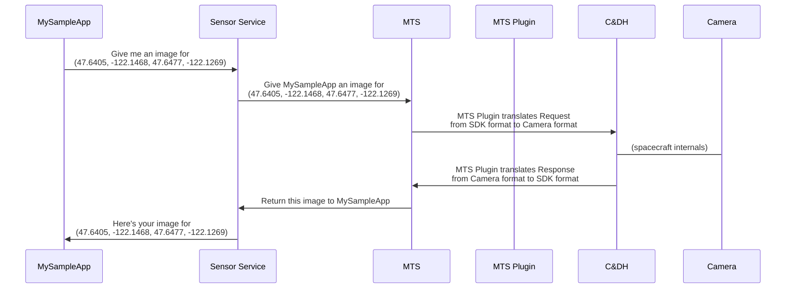
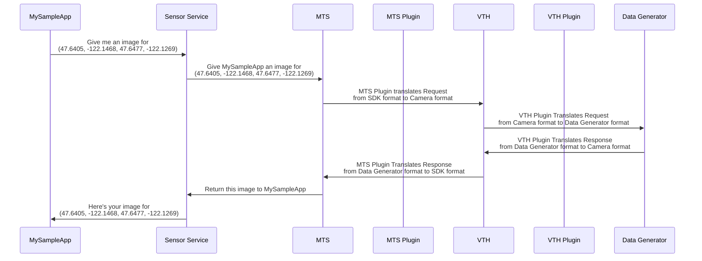

# Azure Orbital Space SDK Virtual Test Harness (VTH)

The Azure Orbital Space SDK Virtual Test Harness (VTH) is an advanced abstraction tool that virtually represents satellite hardware and subsystem capabilities. This allows application developers to develop and test their space-based applications against an environment that closely mirrors the actual satellite systems they will interact with in orbit. By abstracting satellite hardware into a virtual environment, the VTH enables developers to validate application functionality, ensure compatibility with satellite systems, and fine-tune performance without the need for physical hardware. This approach significantly accelerates the development cycle, reduces costs, and increases the reliability of applications destined for space operations.

## Overview

The Azure Orbital Space SDK Virtual Test Harness (VTH) virtualizes the operational capabilities of a physical satellite platform. Like the Azure Orbital Space SDK Runtime Framework, the VTH relies on a plugin architecture so that developers can extend its functionality, giving developers the customization and flexibility they need to define their virtual environments. These plugins facilitate interaction with data generators that provide diverse satellite data for application testing and development.

Data generators are tools that produce synthetic data that mimics the output of satellite sensors and systems. This could include satellite position, orientation, and sensor imagery, as examples. This capability is crucial for developers, as it allows them to test how their applications interact with the satellite payload and process its data without needing actual satellite hardware. By interfacing with these data generators, the VTH enables developers to create realistic and complex scenarios, testing applications under a wide range of conditions to ensure robustness, accuracy, and reliability before deployment in space.

To bridge the gap between virtual testing and real-world application, the Azure Orbital Space SDK Virtual Test Harness (VTH) can be used in both Simulation in the Loop (SITL) and Hardware in the Loop (HITL) configurations. These approaches represent a continuum of testing environments, from fully virtualized simulations to integrations with actual hardware components. SITL focuses on simulating the entire satellite system within a virtual environment, allowing developers to test applications against a broad spectrum of simulated data and scenarios without the need for physical hardware. This method is invaluable for early-stage development and debugging, offering a cost-effective and flexible testing solution.

Transitioning from SITL, HITL incorporates real hardware components into the testing loop, providing a more accurate representation of operational conditions. This hybrid approach enables developers to validate their applications against the physical characteristics and constraints of actual satellite hardware, ensuring compatibility and performance under real-world conditions. By leveraging both SITL and HITL, developers can comprehensively test and refine their space-based applications, ensuring they are robust, reliable, and ready for deployment in the challenging environment of space.

### Simulation in the Loop (SITL)

### Hardware in the Loop (HITL)

## Components

The Azure Orbital Space SDK Virtual Test Harness (VTH) comprises several key components designed to offer a comprehensive and realistic testing environment for space-based applications. These components are crucial for ensuring that applications are robust, reliable, and ready for deployment in the challenging environment of space.

### Virtual Test Harness (VTH)

The Virtual Test Harness (VTH) serves as the cornerstone of the Azure Orbital Space SDK's testing framework. It is a sophisticated simulation tool that abstracts the satellite hardware and subsystem capabilities into a virtual environment. This abstraction allows developers to test and validate their applications against a highly accurate representation of satellite systems without the need for physical hardware. The VTH supports a wide range of testing scenarios, from simple unit tests to complex integration and performance testing, providing developers with the flexibility to tailor their testing approach to their specific needs.

#### Key Features:

- **Dop-In Replacement for Hardware**: Payload Applications and Host Services can communicate with either the VTH or production hardware with zero code changes required.
- **Plugin Architecture**: Allows for the extension and customization of the VTH, enabling developers to simulate specific satellite models and configurations.
- **Integration with Data Generators**: Facilitates testing under various conditions by providing synthetic data that replicates the output of satellite sensors and systems.

#### How it Works - Image Acquisition Example

Here's a simplified example showing the component-level interactions of a payload application requesting an image of the Microsoft campus from a spacecraft's camera sensor on orbit:

Here's what that same request would look like using the Virtual Test Harness with a data generator that mimics the behavior of the on orbit camera sensor:

By replacing the spacecraft and its sensors with a data generator and the VTH, the application can be tested in a predictable and repeatable fashion. The application has know knowledge that it's communicating with a data generator instead of a spacecraft sensor.

### Data Generators

Data Generators are an integral part of the Virtual Test Harness, providing the synthetic data necessary for simulating real-world satellite operations. These tools generate a wide range of data, including satellite telemetry, sensor outputs, and environmental conditions, enabling developers to test how their applications will perform in orbit.

#### Key Features:

- **Diverse Data Production**: Generates a wide variety of data types, from simple telemetry to complex sensor imagery, to support comprehensive testing.
- **Customizable Scenarios**: Allows developers to create specific testing scenarios, including failure modes and edge cases, to ensure thorough application validation.
- **Seamless Integration**: Works in conjunction with the VTH to provide a cohesive and realistic testing environment.

By leveraging the capabilities of the Virtual Test Harness and Data Generators, developers can ensure that their space-based applications are thoroughly tested and validated, reducing the risk of failure and ensuring compatibility with satellite systems. This comprehensive testing framework is essential for the development of reliable and robust applications capable of withstanding the rigors of space operations.

To learn more about data generators, including data generators officially created by the Azure Orbital Space SDK team, see our [Azure Orbital Space SDK Data Generators Documentation](./data-generators/data-generators.md).