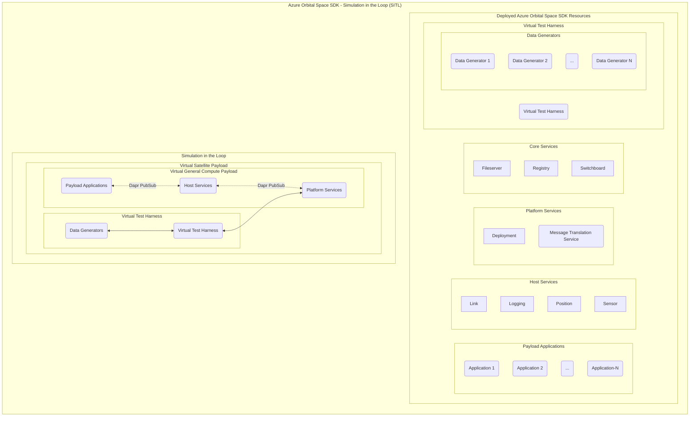
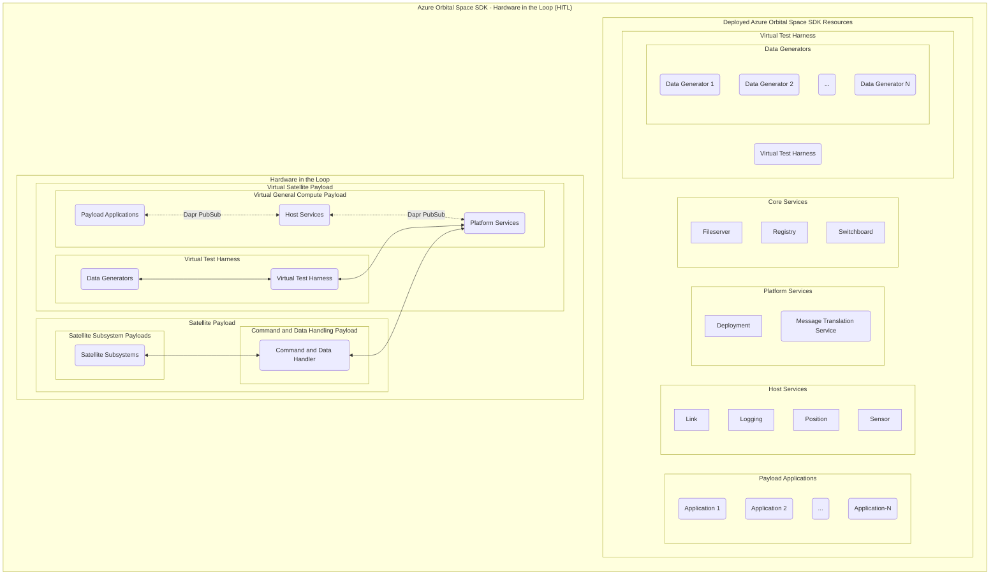

# Azure Orbital Space SDK Virtual Test Harness (VTH)

The Azure Orbital Space SDK Virtual Test Harness (VTH) is an advanced abstraction tool that virtually represents satellite hardware and subsystem capabilities. This allows application developers to develop and test their space-based applications against an environment that closely mirrors the actual satellite systems they will interact with in orbit. By abstracting satellite hardware into a virtual environment, the VTH enables developers to validate application functionality, ensure compatibility with satellite systems, and fine-tune performance without the need for physical hardware. This approach significantly accelerates the development cycle, reduces costs, and increases the reliability of applications destined for space operations.

## Overview

The Azure Orbital Space SDK Virtual Test Harness (VTH) virtualizes the operational capabilities of a physical satellite platform. Like the Azure Orbital Space SDK Runtime Framework, the VTH relies on a plugin architecture so that developers can extend its functionality, giving developers the customization and flexibility they need to define their virtual environments. These plugins facilitate interaction with data generators that provide diverse satellite data for application testing and development.

Data generators are tools that produce synthetic data that mimics the output of satellite sensors and systems. This could include satellite position, orientation, and sensor imagery, as examples. This capability is crucial for developers, as it allows them to test how their applications interact with the satellite payload and process its data without needing actual satellite hardware. By interfacing with these data generators, the VTH enables developers to create realistic and complex scenarios, testing applications under a wide range of conditions to ensure robustness, accuracy, and reliability before deployment in space.

To bridge the gap between virtual testing and real-world application, the Azure Orbital Space SDK Virtual Test Harness (VTH) can be used in both Simulation in the Loop (SITL) and Hardware in the Loop (HITL) configurations. These approaches represent a continuum of testing environments, from fully virtualized simulations to integrations with actual hardware components. SITL focuses on simulating the entire satellite system within a virtual environment, allowing developers to test applications against a broad spectrum of simulated data and scenarios without the need for physical hardware. This method is invaluable for early-stage development and debugging, offering a cost-effective and flexible testing solution.

Transitioning from SITL, HITL incorporates real hardware components into the testing loop, providing a more accurate representation of operational conditions. This hybrid approach enables developers to validate their applications against the physical characteristics and constraints of actual satellite hardware, ensuring compatibility and performance under real-world conditions. By leveraging both SITL and HITL, developers can comprehensively test and refine their space-based applications, ensuring they are robust, reliable, and ready for deployment in the challenging environment of space.

### Simulation in the Loop (SITL)

### Hardware in the Loop (HITL)

## Components

### Virtual Test Harness (VTH)

### Data Generators

The Azure Orbital Space SDK provides several data generators that you can use to develop and test your applications. They're also a great starting point for creating your own data generators for more specialized use cases.

A data generator is any component that produces data to be used for the development and test of payload applications. A data generator could be a web service, an FTP server, an Azure Blob container, or any other source of data that exposes an interface. VTH plugins encapsulate the logic necessary to interact with the data generator, keeping interactions generic elsewhere in the data pipeline. 

#### Planetary Computer

The Azure Orbital Space SDK provides a data generator that integrates with [Planetary Computer](https://planetarycomputer.microsoft.com), Microsoft's multi-petabyte catalog of open environmental monitoring data. Planetary Computer houses a variety of current and historic Earth observational data. This data generator leverages [Planetary Computer's STAC API](https://planetarycomputer.microsoft.com/docs/quickstarts/reading-stac/) to easily query for geotiffs given latitude, longitude, and a broad array of additional query options to further refine results based on collections, time ranges, and assets.

<!-- TODO: Add link to data generator repo -->

#### Image Provider

The Azure Orbital Space SDK Image Provider offers developers an out-of-the-box data generator for vending local image assets. Image Provider supports many data formats including geotiffs, PNGs, and JPEGs. Exposed as a simple web server exposing contents of a local directory, Image Provider offers a lightweight, flexible, and user-friendly starting point for creating custom data generators for sensor imagery.

<!-- TODO: Add link to data generator repo -->

#### Star Viewer

The Azure Orbital Space SDK Star Viewer generates noised grey-scale images of star fields for a given line-of-sight vector. Built on the [Hipparcos-Yale-Gliese Star Catalogue](https://github.com/astronexus/HYG-Database), Star Viewer offers accurate synthetic stellar imagery for space-observation applications.

<!-- TODO: Add link to data generator repo -->

#### Hello World

The Azure Orbital Space SDK Hello World data generator...

<!-- TODO: Finish this and add a link -->

#### Temperature Sensor

The Azure Orbital Space SDK Temperature Sensor provides a lean example of a data generator for non-imagery data. A sensor is anything that captures a measurement. This could be a magnetometer, an altimeter, or accelerometer. In this data generator, a synthetic temperature sensor that returns a random is exposed.

<!-- TODO: Finish this and add a link -->