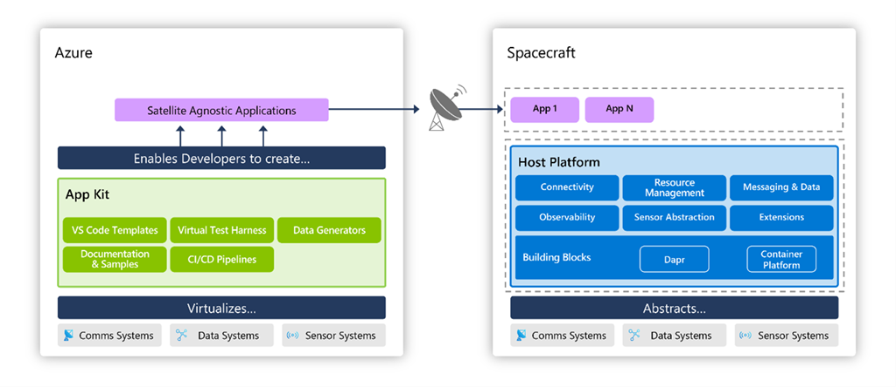
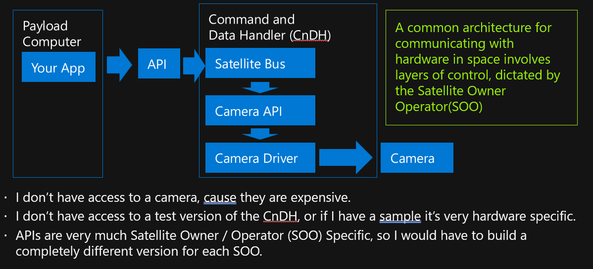
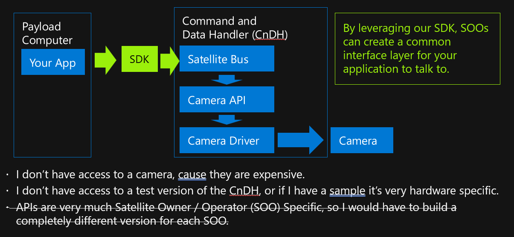
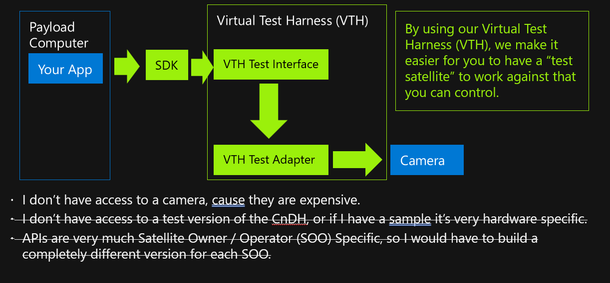
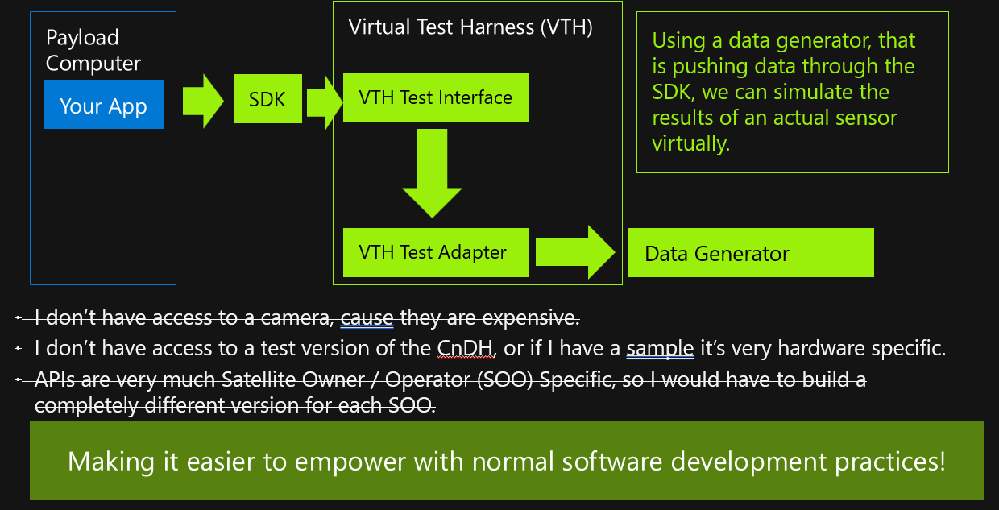
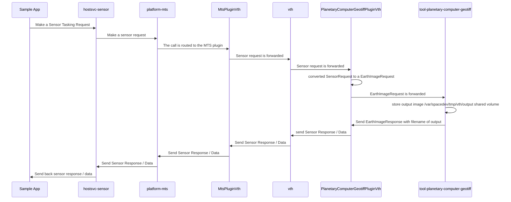

# Azure Orbital Space SDK

The following article outlines the architecture and high level view of the Azure Orbital Space SDK.  

# What is the Azure Orbital Space SDK?

The Azure Orbital Space SDk is a solution designed to lower the barriers to developing applications that are ultimately intended to run on spacecraft. Coding applications to run in space is a different type of process that poses many unique challenges due to the disconnected nature of running on a spacecraft.​

The Azure Orbital Space SDK was created to be able to run on any spacecraft and provide a secure hosting platform and application kit to create, deploy, and operate applications on-orbit. This "host platform" runs onboard the spacecraft including a containerized, scalable compute infrastructure with resource and schedule management capabilities.​

The application kit provides a set of templates, samples, and documentation to make it easy to get up and running as a space developer with template applications for common workload patterns, such as earth observation image processing. There is also a "virtual test harness" that allows developers to easily test their applications on the ground against an instance of the host platform.​

# Why is Space Development Hard?

As mentioned above, developing applications for Space is Hard, and it's because many Satellite Owner/Operators (SOO) support a variety of hardware platforms and expose access to their hardware platform by presenting the payload application with an API to interact with the hardware or Command and Data Handler (CnDH) Computer.  A common communication architecture would be the following:

## APIs are very much Satellite Owner/Operator Specific

The above scenario is made more complex, if the intention is to run the application on more than one SOO's hardware.  To do that, the application must be built to interact with different APIs that function very differently.  

To help resolve this, the SDK implements the tools outlined above.  Firstly we implement the Azure Orbital Space SDK's client libraries (Python and dotnet), which provide a common interface for interacting with the spacecraft for any SOO that supports our platform.

## I do not have access to a Command and Data Handler (CnDH) computer

The next core challenge being, I as a payload app developer do not have access to a CnDH computer, but need to be able to develop against something comparable to build my application.  

To help resolve this, we provide a Virtual Test Harness (VTH) which acts as a CnDH by interfacing with data generators.  These generators could be created by the SOO, a sensor vendor, or even the payload app developer themselves.  

## I do not have access to a camera, and they are expensive

The final of the core challenges, I as a payload app developer do not have access to a camera as they are expensive. This is a major issue as I need to be able to get representative output from that camera to build my application.  This is where data generators come in, and as previous mentioned, those data generators can come from Microsoft in the form of sample data generators, Satellite Owner / Operators, Sensor Vendors themselves, or could be generates that I as the payload app developer build to simulate what I need for my application.

# What does the Azure Orbital Space SDK architecture look like for communication

Now that we've resolved many of the core challenges, what does it look like for our applications to communicate from the payload application, the whole way down to the data generator and back.  

The flow is the following (you can also run the demo described here using our walkthrough for [dotnet](https://github.com/microsoft/Azure-Orbital-Space-SDK-QuickStarts/blob/main/tutorials/quick-start-tutorials/e2e-eo-sample-dotnet.md) or [python](https://github.com/microsoft/Azure-Orbital-Space-SDK-QuickStarts/blob/main/tutorials/quick-start-tutorials/e2e-eo-sample-python.md):

# What are plugins?

To faciliate the level of abstraction required to build our SDK, we created host services, which are docker container applications that our client libraries make requests of to interact with the hardware.  Recognizing that our Satellite Owner / Operator (SOO) customers have many different requirements and needs, we make all of our services extensible by plugins.

Plugins in this case can overload the operations within the host services, platform services, and even the Virtual Test Harness (VTH), to allow for the SOO to customize what the operations inside those host services do.  This provides a high level of flexibility to our SOO customers to expose functionality to their customers.  

# What is Message Translation Service (MTS)?

The key element of communication between the payload app computer, and the underlying CnDH is the implementation of the Message Translation Service (MTS).  The MTS is the point by which the messages coming from the payload app, and then host services can communicate with the spacecraft.  By funnelling requests through the MTS we create an easy point for the Satellite Owner / Operators (SOOs) to interact with their own APIs for the CnDH.  This interaction is done via a plugin.  

# What is Helm?

Helm is the application package manager for Kubernetes that you use to standardize and simplify the deployment of cloud-native applications on Kubernetes. It can also be descirbed as the package manager for Kubernetes. Helm makes it easier for us to package and deploy software on a Kubernetes cluster using charts.

Overall Helm allows for us to be more flexible and tailor it to the enviornment as needed. All while becoming more advanced.
