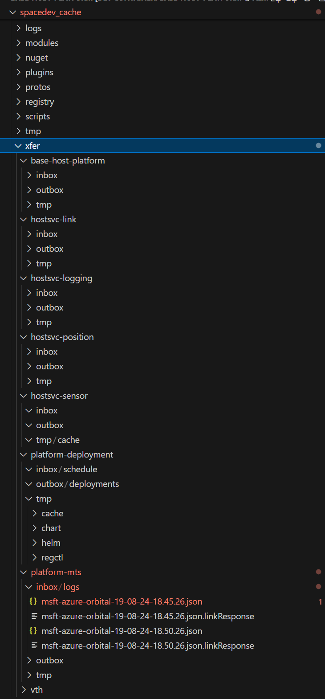

# Base Host Platform

This sample stages and deploys the base services of the Azure Space SDK within its k3s cluster with docker backend. This dev-environment is provided for users to experiement and become familar with the base services of the Azure Space SDK. The following document details general guideline and commands to assist with developing with the Azure Space SDK. If users wish to bring in additional files within the devcontainer to experiment with along with the Azure Space SDK, simply insert any desired files within the current directory.

## Setup - spacedev_cache and /var/spacedev

`spacedev_cache` is a sym-linked directory to `/var/spacedev`, which contains [azure-orbital-space-sdk-setup](https://github.com/microsoft/azure-orbital-space-sdk-setup) and all the staged/deployed artifacts of the Azure Space SDK. All Azure Space SDK files stored on the host will lie within this directory and is available for the SOO to access and view. To perform any changes to the dependencies and/or artifacts used within the Azure Space SDK, please refer to [azure-orbital-space-sdk-setup](https://github.com/microsoft/azure-orbital-space-sdk-setup).

### Azure Space SDK Logs

Travel to `/var/spacedev/logs` to view the logs of any scripts that were executed during the staging and/or deployment of the Azure Space SDK. If deploying the Azure Space SDK through a devcontainer, the devcontainer specific logs are available in `/var/spacedev/logs/<devcontainer-name>`.

### Xfer Directories

All files shared between applications via `hostsvc-link` are available in each applications `xfer` directories. When deployed into the Azure Space SDK, each application will have an `inbox` and `outbox` created where `hostsvc-link` can send and drop files to/from applications. All xfer directories are visible via `/var/spacedev/xfer`. To view any particular service or application's inbox and outbox, travel to `/var/spacedev/xfer/<application_name>`.




## Inspecting Azure Space SDK Pods

1. Evaluate the status of all Azure Space SDK pods via `kubectl`:
    ```bash
    kubectl get pods -A
    ```
    ```text
    root ➜ /workspace/base-host-platform $ kubectl get pods -A
    NAMESPACE     NAME                                      READY   STATUS      RESTARTS   AGE
    coresvc       coresvc-registry-55bb5c94d4-86l7g         1/1     Running     0          6m56s
    coresvc       coresvc-switchboard-69977f89fb-jxrj4      1/1     Running     0          6m41s
    dapr-system   dapr-operator-85f8d87776-pdwtk            1/1     Running     0          6m50s
    dapr-system   dapr-sentry-b5b766dd6-t7sqt               1/1     Running     0          6m50s
    dapr-system   dapr-sidecar-injector-67b764f6ff-9kzm9    1/1     Running     0          6m50s
    hostsvc       hostsvc-link-5b4b5c6b7d-s7ms2             2/2     Running     0          6m36s
    hostsvc       hostsvc-logging-5bb64bf79-mfg5t           2/2     Running     0          6m36s
    hostsvc       hostsvc-position-558c467669-dch6j         2/2     Running     0          6m36s
    hostsvc       hostsvc-sensor-789cdd86f8-7zwnq           2/2     Running     0          6m36s
    kube-system   coredns-576bfc4dc7-qn9k9                  1/1     Running     0          8m18s
    kube-system   helm-install-traefik-crd-8kmtc            0/1     Completed   0          8m18s
    kube-system   helm-install-traefik-qvtgm                0/1     Completed   1          8m18s
    kube-system   local-path-provisioner-6795b5f9d8-fxhhl   1/1     Running     0          8m18s
    kube-system   metrics-server-557ff575fb-hr44h           1/1     Running     0          8m18s
    kube-system   svclb-traefik-906afe47-l8lbw              2/2     Running     0          7m55s
    kube-system   traefik-5fb479b77-sv22z                   1/1     Running     0          7m55s
    payload-app   base-host-platform-68478d6688-pghbf       0/2     Running     0          6m28s
    platformsvc   platform-deployment-6c9459b5f4-htrtt      2/2     Running     0          6m38s
    platformsvc   platform-mts-5cb949864f-s6cdq             2/2     Running     0          6m38s
    platformsvc   vth-5c7d994689-8r7d5                      2/2     Running     0          6m38s
    ```

1. Query the logs of any hostsvc or platformsvc pod:
    ```bash
    # Reference pod via its deployment
    kubectl logs deployment/<hostsvc or platformsvc> -n <hostsvc/platformsvc namespace>

    # Example: platform-mts
    kubectl logs deployment/platform-mts -n platformsvc
    ```
    ```text
    Defaulted container "platform-mts" out of: platform-mts, daprd
    Core.Client Initialized
    [2024-08-19 18:45:03] info: Microsoft.Azure.SpaceFx.Core.Services.PluginLoader[0]
        Services.PluginLoader Initialized
    [2024-08-19 18:45:03] info: Microsoft.Azure.SpaceFx.Core.Services.MessageReceiver[0]
        Services.MessageReceiver Initialized
    [2024-08-19 18:45:03] info: Microsoft.Azure.SpaceFx.Core.Services.MessageReceiver[0]
        App platform-mts v0.11.0.0 is online.  Registered App ID: platform-mts
    [2024-08-19 18:45:03] info: Microsoft.Azure.SpaceFx.Core.Services.MessageReceiver[0]
        Subscribed to 2 topics
    [2024-08-19 18:50:26] info: Microsoft.Azure.SpaceFx.PlatformServices.MessageTranslationService.Utils.MessageRouter[0]
        Services.MessageRouter Initialized.
    [2024-08-19 18:50:26] info: Microsoft.Azure.SpaceFx.PlatformServices.MessageTranslationService.MessageHandler[0]
        Processing message type 'LinkResponse' from 'hostsvc-link' (trackingId: '27431447-5bf9-4da3-9dbb-0d5a467b5aba' / correlationId: '27431447-5bf9-4da3-9dbb-0d5a467b5aba' / status: 'Successful')
    [2024-08-19 18:50:26] info: Microsoft.Azure.SpaceFx.PlatformServices.MessageTranslationService.MessageHandler[0]
        Processing LinkResponse for potential additional file transfer.(trackingId: '27431447-5bf9-4da3-9dbb-0d5a467b5aba' / correlationId: '27431447-5bf9-4da3-9dbb-0d5a467b5aba' / status: 'Successful')
    [2024-08-19 18:55:26] info: Microsoft.Azure.SpaceFx.PlatformServices.MessageTranslationService.MessageHandler[0]
        Processing message type 'LinkResponse' from 'hostsvc-link' (trackingId: 'ed692c7a-a9b2-40e0-9643-478df6c3d947' / correlationId: 'ed692c7a-a9b2-40e0-9643-478df6c3d947' / status: 'Successful')
    [2024-08-19 18:55:26] info: Microsoft.Azure.SpaceFx.PlatformServices.MessageTranslationService.MessageHandler[0]
        Processing LinkResponse for potential additional file transfer.(trackingId: 'ed692c7a-a9b2-40e0-9643-478df6c3d947' / correlationId: 'ed692c7a-a9b2-40e0-9643-478df6c3d947' / status: 'Successful')
    ```

1. View `hostsvc-logging` logs within `/var/spacedev/xfer/platform-mts/inbox/logs`. For more details regarding `hostsvc-logging` generated logs, please reference [hostsvc-logging](https://github.com/microsoft/azure-orbital-space-sdk/blob/main/docs/architecture/runtime-framework/host-services/logging.md)
    ```bash
    # After 
    root ➜ /workspace/base-host-platform $ tree /var/spacedev/xfer/platform-mts/inbox/logs
    /var/spacedev/xfer/platform-mts/inbox/logs
    ├── msft-azure-orbital-19-08-24-18.45.26.json
    ├── msft-azure-orbital-19-08-24-18.45.26.json.linkResponse
    ├── msft-azure-orbital-19-08-24-18.50.26.json
    ├── msft-azure-orbital-19-08-24-18.50.26.json.linkResponse
    ├── msft-azure-orbital-19-08-24-18.55.26.json
    ├── msft-azure-orbital-19-08-24-18.55.26.json.linkResponse
    ├── msft-azure-orbital-19-08-24-19.00.26.json
    ├── msft-azure-orbital-19-08-24-19.00.26.json.linkResponse
    ├── msft-azure-orbital-19-08-24-19.05.27.json
    ├── msft-azure-orbital-19-08-24-19.05.27.json.linkResponse
    ├── msft-azure-orbital-19-08-24-19.10.27.json
    ├── msft-azure-orbital-19-08-24-19.10.27.json.linkResponse
    ├── msft-azure-orbital-19-08-24-19.15.27.json
    ├── msft-azure-orbital-19-08-24-19.15.27.json.linkResponse
    ├── msft-azure-orbital-19-08-24-19.20.27.json
    └── msft-azure-orbital-19-08-24-19.20.27.json.linkResponse
    ```


