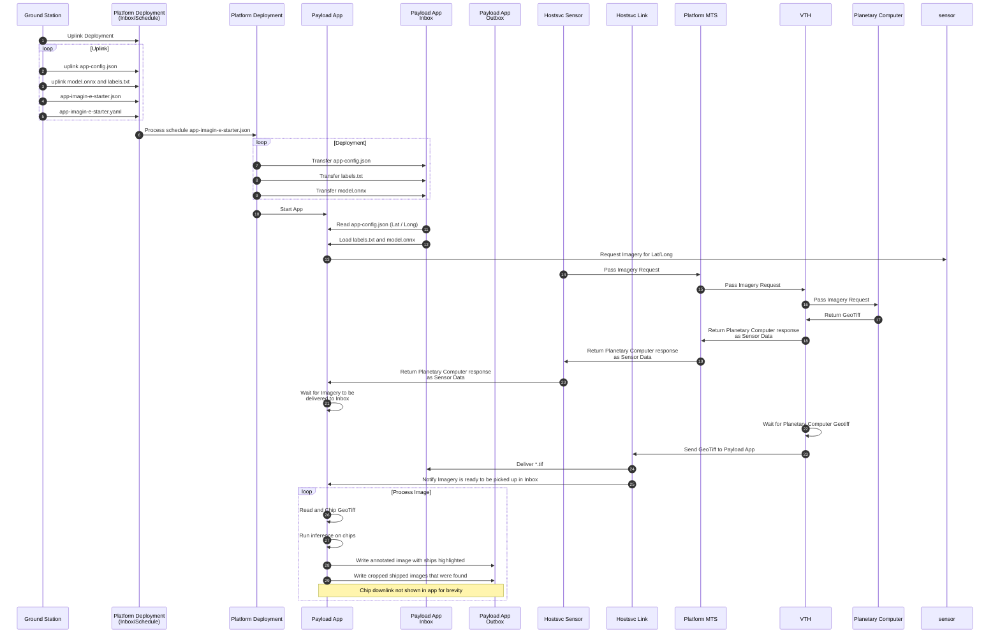
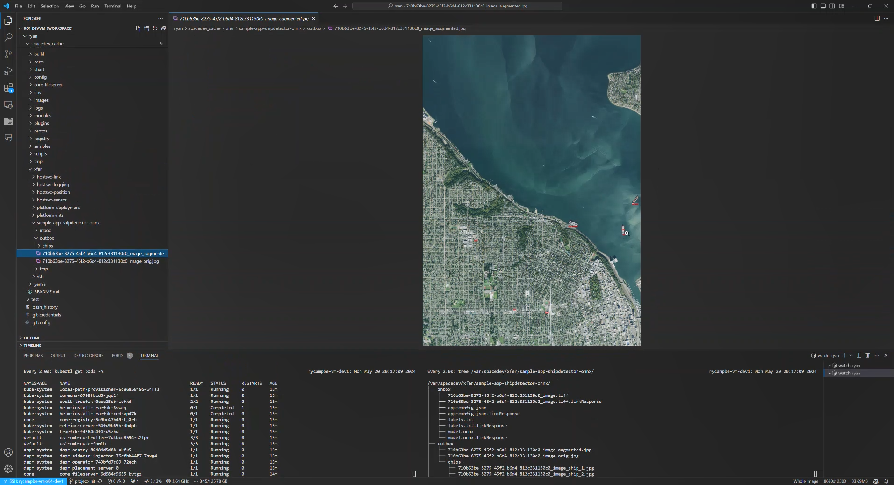
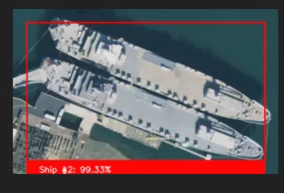

# Sample App - IMAGIN-e Ship Detector (ONNX)

This repository is a start sample payload application used to demonstrate how to develop an app targetted at the IMAGIN-e payload environment. This application implements the same ONNX based ship detection model as in our other python sample apps.

In its test configuration, this app utilizes either a staged file, or Planetary Computer to query for imagery, then runs an  ship detection inference model from onnx.  The input imagery is loaded from the application's inbox, while the outputs are saved to the application's outbox.

## High Level Flow of Payload App

Below is a high-level flow of the payload app.  See **[Direct Link](./images/mermaid-app-flow.png)** if the diagram does not render.



## Running the sample via a DevContainer

### Prerequisites:

* You'll need to be able to [run DevContainers](https://github.com/microsoft/Azure-Orbital-Space-SDK-QuickStarts/blob/main/docs/walkthroughs/using-devcontainers.md) authenticated with your GitHub profile
* If you want to experiment with the IMAGIN-e sensor interface, you will need to acquire the .proto specifications from TAS-E, and then put them in the .protos directory of the app folder.

>NOTE: A starter model.onnx and labels.txt is included in the `./model` directory.  This model is an example only and should not be used for production workloads.  You can generate your own models via [Custom Vision](https://www.customvision.ai/)

## Steps to Run the Sample
1. Build DevContainer without Cache
1. Wait for DevContainer to finish building
1. Run the task `Debug Client`

The `./.vscode/launch.json` and subsequent `./.vscode/tasks.json` are preconfigured to copy

* `./schedules/debug_image/app-config.json`
* `./model/model.onnx`
* `./model/labels.txt`

to `/var/spacedev/xfer/app-imagin-e-starter/inbox` to simulate the same event as a production run.

Once complete, the output will be saved to `/var/spacedev/xfer/app-imagin-e-starter/outbox` (symlinked: `./spacedev_cache/xfer/app-imagin-e-starter/outbox`)



and individual chips:




## Running the sample in a Production Cluster (via Deployment Service)

Deploying this sample in a production cluster requires a couple extra artifacts since VTH and Planetary Computer are not normally deployed; Production is intended for satellite / on-obrit compute, where-as VTH and Planetary Computer require internet connectivity.  The below steps explictly deploy the components that are not normally deployed to satellite / on-orbit compute to run the sample app.

1. Clone the Microsoft Azure Space SDK Setup repo

   ```bash
    git clone https://github.com/microsoft/azure-orbital-space-sdk-setup
    cd azure-orbital-space-sdk-setup
    bash ./.vscode/copy_to_spacedev.sh
    cd -
   ```

1. Deploy the cluster with extra artifacts used by the sample app

    ```bash
    # Stage the cluster with planetary-computer datagenerator, and the plugin artifacts for them to communicate
    /var/spacedev/scripts/stage_spacefx.sh --vth \
                --container datagenerator-planetary-computer:0.11.0-nightly \
                --artifact PlanetaryComputer.proto \
                --artifact datagenerator-planetary-computer.yaml \
                --artifact planetary-computer-vth-plugin.dll \
                --artifact planetary-computer-vth-plugin.json.spacefx_plugin

    # Deploy the cluster as normal
    /var/spacedev/scripts/deploy/deploy_spacefx.sh
    ```

1. Build the Container Image (~850MB)

    ```bash
    /var/spacedev/build/build_containerImage.sh \
        --dockerfile ${PWD}/samples/payloadapps/python/imagin-e-app/docker/Dockerfile.prod \
        --app-name app-imagin-e-starter \
        --image-tag 0.11.0 \
        --architecture amd64 \
        --repo-dir ${PWD}/samples/payloadapps/python/imagin-e-app \
        --build-arg APP_DIRECTORY=/workspace/app-imagin-e-starter \
        --devcontainer-json .devcontainer/app-imagin-e-starter/devcontainer.json \
        --annotation-config azure-orbital-space-sdk.yaml \
        --no-push
    ```

1. Tag the new image and push to the Microsoft Azure Orbital Space SDK Cluster

    ```bash
    docker tag app-imagin-e-starter:0.11.0-nightly registry.spacefx.local:5000/app-imagin-e-starter:0.11.0-nightly
    docker push registry.spacefx.local:5000/app-imagin-e-starter:0.11.0-nightly
    ```


1. Deploy the Payload App by copying the schedule file, deployment yaml, and artifacts to Platform Deployment's inbox/schedule directory

    ```bash
    # Copy the model dir contents to Platform-Deployment Inbox (model.onnx and labels.txt)
    sudo cp ${PWD}/model/* /var/spacedev/xfer/platform-deployment/inbox/schedule/

    # Copy the schedule file and deployment yaml to trigger the deployment
    sudo cp ${PWD}/schedules/prod/* /var/spacedev/xfer/platform-deployment/inbox/schedule/
    ```

1. Start monitoring the payload app's `xfer` directory

    ```bash
    watch -n 2 tree /var/spacedev/xfer/app-imagin-e-starter
    ```

The app will finish processing and output the results to `/var/spacedev/xfer/app-imagin-e-starter/outbox`.  Changing the model can be done by copying a different model.onnx file in the above step.