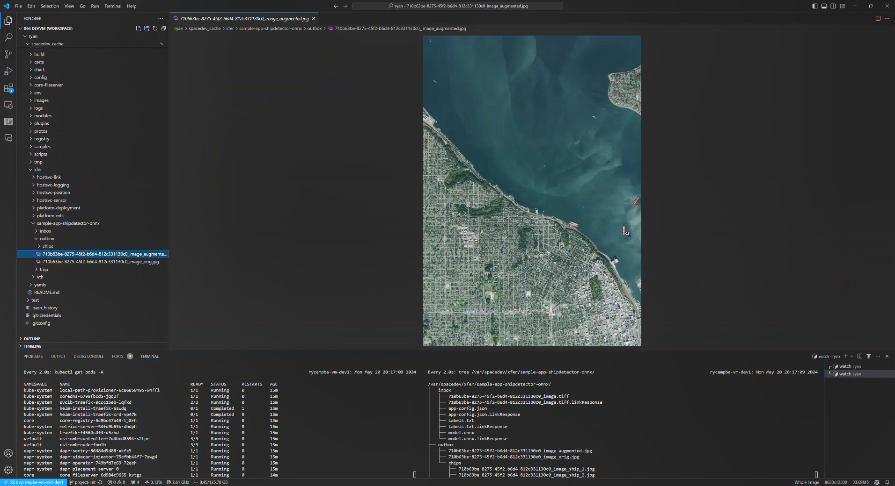
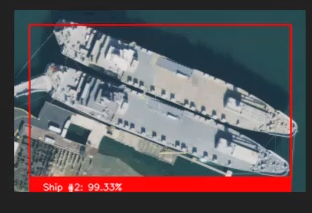

# Sample App - Ship Detector (ONNX)

This repository is a sample payload application leveraging Planetary Computer to query for imagery, then run an inference ship detection model from onnx.  The input imagery is loaded from the application's inbox, while the outputs are saved to the application's outbox.

## High Level Flow of Payload App

Below is a high-level flow of the payload app.  See **[Direct Link](./images/mermaid-app-flow.png)** if the diagram does not render.


## Running the sample via a DevContainer

Prerequisites:

* You'll need to be able to [run DevContainers](https://github.com/microsoft/Azure-Orbital-Space-SDK-QuickStarts/blob/main/docs/walkthroughs/using-devcontainers.md) authenticated with your GitHub profile

>NOTE: A starter model.onnx and labels.txt is included in the `./model` directory.  This model is an example only and should not be used for production workloads.  You can generate your own models via [Custom Vision](https://www.customvision.ai/)

1. Build DevContainer without Cache
1. Wait for DevContainer to finish building
1. Run the task `Debug Client`

The `./.vscode/launch.json` and subsequent `./.vscode/tasks.json` are preconfigured to copy

* `./schedules/debug_image/app-config.json`
* `./model/model.onnx`
* `./model/labels.txt`

to `/var/spacedev/xfer/app-python-shipdetector-onnx/inbox` to simulate the same event as a production run.

Once complete, the output will be saved to `/var/spacedev/xfer/app-python-shipdetector-onnx/outbox` (symlinked: `./spacedev_cache/xfer/app-python-shipdetector-onnx/outbox`)



and individual chips:




## Running the sample in a Production Cluster (via Deployment Service)

Prerequisites:

* You'll need to have a destination container registry already configured through env-config to push the newly built image to
* [Devcontainer CLI](https://code.visualstudio.com/docs/devcontainers/devcontainer-cli) installed (for building the debug image)
* [SDK Setup Outside of DevContainer](https://github.com/microsoft/Azure-Orbital-Space-SDK-QuickStarts/blob/main/docs/walkthroughs/setup-sdk-no-devcontainer.md) Steps 1-3.  Stage_SpaceFX.sh and Deploy_SpaceFx.sh are not needed
  * Assumes spacedev directory is `/var/spacedev`
* This repo cloned as the current working directory

### Build Debug Image

Build and push the debug image:

```bash
/var/spacedev/build/build_containerImage.sh \
    --dockerfile /var/spacedev/build/python/Dockerfile.python.app.debug \
    --app-name app-python-shipdetector-onnx \
    --image-tag 0.10.0-debug \
    --architecture amd64 \
    --repo-dir ${PWD} \
    --extract_env_config false \
    --build-arg APP_DIRECTORY=/workspaces/app-python-shipdetector-onnx
```

This will deploy k3s in the development configuration to build the app.  Once complete, reset the host with `big_red_button.sh`

```bash
/var/spacedev/scripts/big_red_button.sh
```

### Deploy Cluster with Data Generator and VTH

Deploying this sample in a production cluster requires a couple extra artifacts since VTH and Planetary Computer are not normally deployed; Production is intended for satellite / on-obrit compute, where-as VTH and Planetary Computer require internet connectivity.  The below steps explictly deploy the components that are not normally deployed to satellite / on-orbit compute to run the sample app.

>NOTE: Prior to running the below commands, make sure your /var/spacedev has been provisioned following [SDK Setup Outside of DevContainer](https://github.com/microsoft/Azure-Orbital-Space-SDK-QuickStarts/blob/main/docs/walkthroughs/setup-sdk-no-devcontainer.md) (Steps 1-3.  Do not run `stage_spacfx.sh` nor `deploy_spacefx.sh` until instructed below.

1. Deploy the cluster with extra artifacts used by the sample app

    ```bash
    # Stage the cluster with planetary-computer-geotiff datagenerator, the app-python-shipdetector-onnx, and the applicable artifacts for them to communicate
    /var/spacedev/scripts/stage/stage_spacefx.sh --vth \
                --container tool-planetary-computer-geotiff:0.10.0 \
                --container app-python-shipdetector-onnx:0.10.0-debug --vth \
                --build-artifact PlanetaryComputerGeotiff.proto \
                --build-artifact MtsPluginVTH.dll \
                --build-artifact MtsPluginVTH.json.spacefx_plugin \
                --build-artifact PlanetaryComputerGeotiffPluginVth.dll \
                --build-artifact PlanetaryComputerGeotiffPluginVth.json.spacefx_plugin

    # Deploy the cluster as normal
    /var/spacedev/scripts/deploy/deploy_spacefx.sh

    # Deploy the planetary_computer datagenerator, skipping the staging step since it's already been staged above
    /var/spacedev/samples/datagenerator/deploy_data_generator.sh --planetary_computer --nostage
    ```

1. Deploy the Payload App by copying the schedule file, deployment yaml, and artifacts to Platform Deployment's inbox/schedule directory

    ```bash
    # Copy the model dir contents to Platform-Deployment Inbox (model.onnx and labels.txt)
    sudo cp ${PWD}/model/* /var/spacedev/xfer/platform-deployment/inbox/schedule/

    # Copy the schedule file and deployment yaml to trigger the deployment
    sudo cp ${PWD}/schedules/debug_image/* /var/spacedev/xfer/platform-deployment/inbox/schedule/
    ```

1. Start monitoring the payload app's `xfer` directory

    ```bash
    watch -n 2 tree /var/spacedev/xfer/app-python-shipdetector-onnx
    ```

The app will finish processing and output the results to `/var/spacedev/xfer/app-python-shipdetector-onnx/outbox`.  Changing the model can be done by copying a different model.onnx file in the above step.