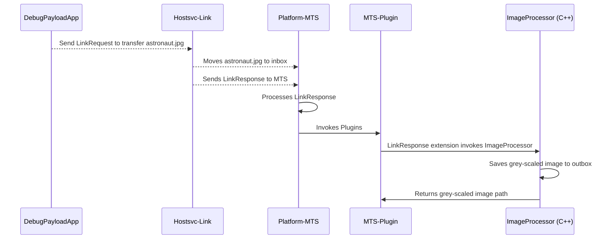

# Platform-MTS C++ Sample Plugin

In this sample, a plugin for the [Message Translation Service](../../../../../docs/architecture/runtime-framework/platform-services/message-translation-service.md) uses .NET's [DllImportAttribute Class](https://learn.microsoft.com/en-us/dotnet/api/system.runtime.interopservices.dllimportattribute?view=net-8.0) to load a shared object library compiled from C++ source code that converts RGB images to grey-scale. This demonstrates how plugin developers can leverage new or existing assets from other languages to extend the functionality of the [Azure Orbital Space SDK Runtime Framework](../../../../../docs/architecture/runtime-framework/runtime-framework.md). This approach allows for the seamless integration of high-performance C++ code into the .NET ecosystem, providing an efficient way to handle resource-intensive tasks like image processing.

## Running this Sample

To try this sample, open the `platform-mts-cpp-sample-plugin` devcontainer. This can be done by opening this project in Visual Studio Code, hitting `F1` to select `Dev Containers: Rebuild Without Cache and Reopen in Container` in the Command Pallette, then choosing `platform-mts-cpp-sample-plugin`.

Once your devcontainer has built, run the sample via the `platform-mts & DebugPayloadApp` Run and Debug Task. Then open the `Explorer` in VSCode and expand the `spacedev_cache/xfer/platform-mts/outbox` directory. After a few moments, `astronaut.jpg` should appear, which is a grey-scaled version of the original `astronaut.jpg` present in `sampleData/astronaut.jpg`.

### astronaut.jpg

### grey-scaled astronaut.jpg

## C++ Sample Plugin Architecture

This sample plugin consists of three primary components:

1. .NET source code for the platform-mts plugin: [platform-mts-cpp-sample-plugin](./src/plugin.cs)

1. C++ code for image processing capabilities: [ImageProcessor](./src/ImageProcessor/ImageProcessor.cpp)

1. .NET source code for the VSCode debug task: [debugPayloadApp](./debugPayloadApp/Program.cs)

### platform-mts-cpp-sample-plugin

Built off of the [Platform-MTS Starter Plugin](../starter-plugin/README.md), this plugin extends the functionality of LinkResponse handling to convert files from RBG to grey-scale using the ImageProcessor shared object library.

### Image Processor

Using [OpenCV's APIs for C++](https://www.opencv-srf.com/2017/11/opencv-cpp-api.html), ImageProcessor is a small C++ utility that converts images from RGB to grey-scale. It takes filepaths for the input image and output image locations as arguments, saving the grey-scale image at the desired location and returning the output image path. If image generation was not successful, and empty file path is returned instead.

### DebugPayloadApp

DebugPayloadApp is a debugging application that is used to interact with platform-mts and its plugins in a debug context. In this example DebugPayloadApp has been designed to transfer [astronaut.jpg](./sampleData/astronaut.jpg) from the local disk to DebugPayloadApp's outbox directory. DebugPayloadApp then sends a LinkRequest to transfer `astronaut.jpg` form its outbox to the platform-mts inbox. This triggers the `platform-mts-cpp-sample-plugin` extension of LinkResponse handling to process `astronaut.jpg` from the inbox directory and generate a grey-scaled `astronaut.jpg` directory in its outbox directory, where it can then be transferred to any other service or application via a LinkRequest.

## C++ Sample Plugin Debug Flow Diagram

